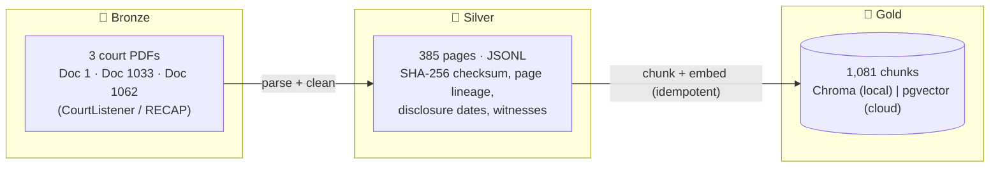
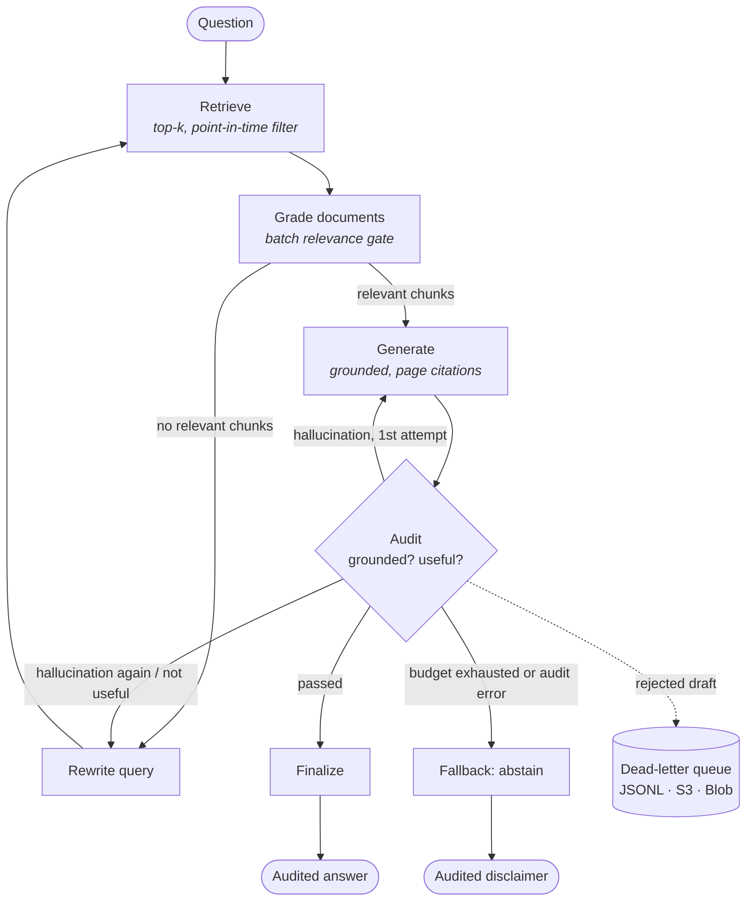

<div align="center">

# ⚖️ LangGraph Legal RAG

### Self-correcting, auditable RAG over the *U.S. v. Google* antitrust court record — cloud-agnostic by design

[](https://github.com/rodrigo85/langgraph-legal-rag/actions/workflows/ci.yml)
[](https://www.python.org/)
[](https://langchain-ai.github.io/langgraph/)
[](infra/README.md)
[](LICENSE)

</div>

A retrieval-augmented agent that answers investigative questions about the federal antitrust case **U.S. v. Google LLC** (the DOJ complaint, the liability opinion and the DOJ’s proposed final judgment on remedies — 385 pages), and **refuses to answer rather than hallucinate**. Every answer is audited for grounding by a second LLM pass; rejected drafts are sent to a dead-letter queue for review and future preference tuning.

The same container runs **locally (Ollama + pgvector + LocalStack/Azurite)**, on **AWS (Bedrock + RDS + S3 + ECS)** or on **Azure (Azure OpenAI + PostgreSQL Flexible Server + Blob + Container Apps)** — only environment variables change.

---

## What this project demonstrates

| Area | Implementation |
| :--- | :--- |
| **Agent orchestration** | LangGraph state machine with self-correction loops, a **provably bounded** retry budget and graceful abstention |
| **Reliability** | Grounding/usefulness auditor that **fails closed** (an unauditable answer is never delivered) |
| **Data engineering** | Medallion pipeline (Bronze PDFs → Silver JSONL with checksums and lineage → Gold vectors), point-in-time retrieval filter |
| **Cloud portability** | Provider factory (Ollama / Bedrock / Azure OpenAI), vector store adapter (Chroma / pgvector), DLQ adapter (JSONL / S3 / Azure Blob) |
| **Serving** | FastAPI with request IDs, API-key auth, timeouts, liveness/readiness probes, OpenAPI docs |
| **Observability** | Structured JSON logs correlated by `request_id`, OpenTelemetry traces (Jaeger locally) |
| **Infrastructure as code** | Terraform for AWS and Azure, statically validated in CI (**never applied — zero cost**) |
| **Quality gates** | 77 unit tests (no network), 4 integration tests, Ruff lint + format, pre-commit, GitHub Actions |

---

## Architecture

### Data pipeline (Medallion)



### Self-correcting agent (LangGraph)



The retry budget (`MAX_RETRIES`) makes termination a guarantee, not a hope: unit tests build the real graph with a grader that *always* rejects and assert it stops in fallback after exactly `2 × MAX_RETRIES + 1` audits.

### Deployment topology

| Component | Local simulation (Docker, free) | AWS | Azure |
| :--- | :--- | :--- | :--- |
| API container | `docker compose` | ECS Fargate + ALB | Container Apps |
| LLM + embeddings | Ollama on the host GPU | Amazon Bedrock | Azure OpenAI |
| Vector store | `pgvector/pgvector:pg16` | RDS PostgreSQL + pgvector | PostgreSQL Flexible Server + vector |
| Dead-letter queue | LocalStack S3 / Azurite Blob | S3 (versioned, lifecycle) | Blob Storage |
| Traces | Jaeger | ADOT → X-Ray | Azure Monitor |
| Secrets | `.env` | Secrets Manager → task secrets | Key Vault references |

Details and Terraform modules: [`infra/`](infra/README.md).

---

## Results (measured, including the unflattering ones)

**End-to-end run of the local production simulation** (API container + pgvector + LocalStack + Azurite + Jaeger, `qwen2.5:7b` on an RTX 2060):

- Gold layer indexed into pgvector by the batch job: **1,081 chunks in 21 s**.
- A query about Satya Nadella's testimony: **HTTP 200 in 18 s**, `grounded` / `useful`, pages 115 and 255 cited; the same `request_id` appears in every node's log line and in the Jaeger trace.
- An earlier run of the same question rejected its first draft: the incident landed in **S3** as `incidents/2026/09/23/<id>.json`.
- Switching `DLQ_BACKEND=azure_blob`: a question the retriever could not support ended in **abstention after 3 correction cycles (82 s)**, with **7 rejected drafts** stored in **Blob Storage** — no hallucination was returned.

**Prompt specialization benchmark** ([report](reports/training_evolution.md)) — three configurations of the *same* base model, no weight fine-tuning:

| Configuration | Heuristic score (0–100) | Answers citing `[Pág. N]` |
| :--- | :---: | :---: |
| Base `qwen2.5:7b-instruct-q3_K_M` | 42.0 | 0% |
| Modelfile v1 (domain system prompt) | 76.0 | 100% |
| Modelfile v2 (structured Evidence / Analysis / Conclusion prompt) | 82.0 | 100% |

### Known limitations

- **The judge is as small as the generator.** The auditor is the same 7B quantized model; in one run it approved an answer with a wrong figure. In production the auditor should be a stronger model (e.g. Claude on Bedrock or GPT-4-class on Azure — a config change here) and be evaluated against a labeled set.
- **Retrieval recall is the bottleneck.** Pure vector top-4 missed the passage stating Google paid Apple 36% of Safari revenue, so the agent (correctly) abstained. Next step: hybrid BM25 + vector search with a cross-encoder reranker.
- **The benchmark is small and heuristic** (4 scenarios, keyword/format scoring; page numbers are checked for format, not validity).
- **No weight fine-tuning yet.** The SFT/CoT/DPO datasets in `data/training/` are prepared for a future LoRA run.
- **Cloud infrastructure is validated, not deployed** (`terraform validate` in CI) to keep this personal project at zero cost.

---

## Quickstart

### 1. Local development (virtualenv + Ollama)

```bash
python -m venv .venv && source .venv/bin/activate     # Windows: .venv\Scripts\activate
pip install -e ".[dev]"

ollama pull qwen2.5:7b-instruct-q3_K_M && ollama pull nomic-embed-text
make specialize          # registers antitrust-specialist(-v2) from the Modelfiles
make pipeline            # Bronze -> Silver -> Gold (Chroma on disk)

make test                # 77 unit tests, no network
make run                 # interactive CLI
make api                 # http://localhost:8000/docs
```

### 2. Local production simulation (Docker)

```bash
make up                  # API + pgvector + LocalStack (S3) + Azurite + Jaeger
make index               # one-off job: build the Gold layer inside pgvector
make up-azure            # same stack, DLQ on Azure Blob (Azurite)

curl -X POST localhost:8000/v1/query \
  -H "X-API-Key: local-dev-key" -H "Content-Type: application/json" \
  -d '{"question": "O que Satya Nadella testemunhou sobre o Bing?"}'
```

Jaeger UI: http://localhost:16686 · OpenAPI: http://localhost:8000/docs · Service-by-service guide: [`docker/README.md`](docker/README.md)

### 3. Cloud

The app reads only environment variables. For AWS: `LLM_PROVIDER=bedrock`, `VECTOR_STORE=pgvector`, `DLQ_BACKEND=s3`. For Azure: `LLM_PROVIDER=azure_openai`, `VECTOR_STORE=pgvector`, `DLQ_BACKEND=azure_blob`. See [`infra/terraform/aws`](infra/terraform/aws/README.md) and [`infra/terraform/azure`](infra/terraform/azure/README.md) — running them creates billable resources.

---

## Configuration

All settings live in [`src/legal_rag/config.py`](src/legal_rag/config.py) (pydantic-settings) and can be set as environment variables:

| Variable | Default | Purpose |
| :--- | :--- | :--- |
| `LLM_PROVIDER` / `EMBEDDING_PROVIDER` | `ollama` | `ollama` · `bedrock` · `azure_openai` |
| `OLLAMA_BASE_URL`, `OLLAMA_LLM_MODEL`, `OLLAMA_EMBED_MODEL` | local | Ollama endpoint and models |
| `AWS_REGION`, `BEDROCK_LLM_MODEL_ID`, `BEDROCK_EMBED_MODEL_ID` | `us-east-1`, Claude, Titan v2 | Bedrock |
| `AZURE_OPENAI_ENDPOINT`, `AZURE_OPENAI_API_KEY`, `AZURE_OPENAI_*_DEPLOYMENT` | — | Azure OpenAI |
| `VECTOR_STORE`, `PGVECTOR_DSN` | `chroma` | `chroma` · `pgvector` |
| `DLQ_BACKEND`, `DLQ_S3_BUCKET`, `AWS_ENDPOINT_URL`, `AZURE_STORAGE_CONNECTION_STRING` | `jsonl` | `jsonl` · `s3` · `azure_blob` |
| `TOP_K_DOCUMENTS`, `MAX_RETRIES`, `CHUNK_SIZE`, `CHUNK_OVERLAP` | 4, 3, 1000, 200 | RAG hyperparameters |
| `API_KEY`, `REQUEST_TIMEOUT_SECONDS` | —, 180 | API auth and timeout |
| `LOG_FORMAT`, `LOG_LEVEL`, `OTEL_ENABLED`, `OTEL_EXPORTER_OTLP_ENDPOINT` | `text`, `INFO`, `false` | Observability |

---

## Repository layout

```
├── src/legal_rag/
│   ├── agent/            # LangGraph state, nodes, routing edges, graph
│   ├── chains/           # LLM chains with Pydantic structured outputs (graders, generator, rewriter)
│   ├── api/              # FastAPI service
│   ├── pipeline/         # Bronze downloader, Silver parser, Gold indexer, docket registry
│   ├── storage/          # vector store and dead-letter queue adapters
│   ├── evaluation/       # benchmarks and cross-layer data quality audit
│   ├── training/         # Modelfiles, dataset generation (SFT / CoT / DPO)
│   ├── providers.py      # LLM / embedding provider factory
│   ├── observability.py  # JSON logging, OpenTelemetry
│   └── config.py         # typed settings
├── tests/unit/           # fast, offline (fakes, moto)
├── tests/integration/    # real Ollama + index (pytest -m integration)
├── docker/               # multi-stage Dockerfile, LocalStack init
├── docker-compose.yml    # local production simulation
├── infra/terraform/      # AWS and Azure modules (validated, not applied)
├── data/                 # raw PDFs, metadata, samples, training datasets, DLQ log
└── reports/              # evaluation reports and case study
```

The [case study](reports/case_study_self_healing_and_dlq.md) walks through real incidents: a hallucinated executive caught by the auditor, the infinite-loop bug and its bounded fix, and the false-premise abstention flow.

---

## Roadmap

- Hybrid retrieval (BM25 + vectors) and a cross-encoder reranker; HNSW index in pgvector
- Stronger, separately evaluated auditor model; labeled evaluation set with CI regression gate
- LoRA fine-tuning on the prepared SFT/DPO datasets
- Keyless auth (managed identity / IAM roles) for Azure OpenAI and Blob

## License

[MIT](LICENSE) © Rodrigo Andreatta da Costa
