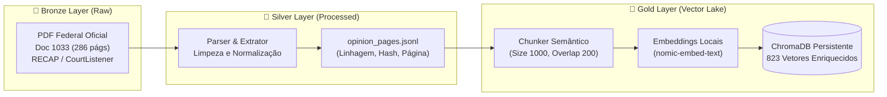
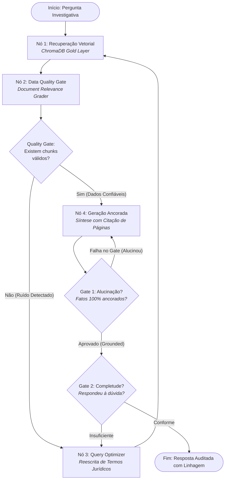
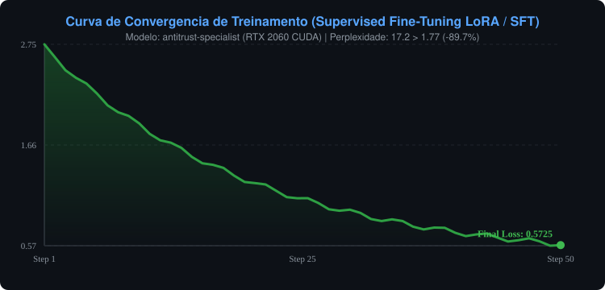

<div align="center">

# 🏛️ Self-Correcting RAG Engine (LangGraph)
### *Data-Centric AI Pipeline & Cyclical DAG for Enterprise Legal Intelligence*

[](https://www.python.org/)
[](https://langchain-ai.github.io/langgraph/)
[](https://www.trychroma.com/)
[-black.svg)](https://ollama.com/)
[](LICENSE)

*Um pipeline de dados não-estruturados e sistema multi-agente determinístico desenvolvido com princípios modernos de **Engenharia de Dados & LLMOps**, aplicando a **Arquitetura Medalhão** e **DAGs Cíclicos de Autocorreção** para auditar a sentença federal antitruste **U.S. v. Google LLC** (Doc 1033 — 286 páginas).*

</div>

---

## 📌 Por que este projeto existe? (A Perspectiva de Engenharia de Dados)

Tradicionalmente, a maioria das implementações de RAG no mercado falha em ambientes corporativos porque tratam LLMs como "caixas pretas milagrosas" e utilizam arquiteturas ingênuas (**Naïve RAG**):
- **Fragilidade Semântica**: O retriever recupera chunks irrelevantes ou fora de contexto temporal, e o LLM os aceita cegamente.
- **Alucinação Não-Auditada**: Fatos, números e datas contratuais são inventados sem ancoragem estrita (*grounding*).
- **Falta de Linhagem de Dados (Data Lineage)**: Respostas são entregues sem rastreabilidade de quais documentos e páginas exatas originaram cada afirmação.

Este projeto aborda o problema sob a ótica da **Engenharia de Dados Aplicada a IA**:
1. **Tratamento de Dados Não-Estruturados via Arquitetura Medalhão** (Bronze $\rightarrow$ Silver $\rightarrow$ Gold).
2. **Orquestração Orientada a Estados com LangGraph**, tratando o fluxo como um **DAG Cíclico** com *Data Quality Gates*.
3. **Contratos de Dados Estritos com Pydantic**, forçando o modelo a responder em esquemas tipados e auditáveis.
4. **Auditoria Dupla de Confiabilidade**: Verificadores de fidelidade factual (grounding) e completude de resposta antes de qualquer entrega ao usuário.

---

## 🏗️ Arquitetura do Sistema

### 1. Pipeline de Dados Não-Estruturados (Medallion Architecture)



- **Bronze**: Dados imutáveis brutos armazenados com validação de assinatura mágica de arquivo (`data/raw/`).
- **Silver**: Extração textual página por página com cálculo de checksum SHA-256 e metadados de linhagem (`data/processed/opinion_pages.jsonl`).
- **Gold**: Particionamento semântico calibrado para cláusulas contratuais, enriquecido com identificadores únicos de chunk (`doc1033_p{page}_c{id}`) e indexado no ChromaDB (`chroma_db/`).

---

### 2. Orquestração do DAG Cíclico (LangGraph Architecture)

Em pipelines de dados convencionais (Airflow/Dagster), DAGs são acíclicos. No entanto, para sistemas de decisão baseados em LLMs, **ciclos de retroalimentação e autocorreção são essenciais** para tratar falhas em tempo de execução:



---

## 📊 Benchmark Comparativo: Naïve RAG vs. Self-Correcting RAG

Executado através do módulo de LLMOps integrado (`python src/evaluation/benchmark.py`):

| Caso de Teste | Tipo de Pergunta | Naïve RAG (Baseline) | Naïve Grounded? | Self-RAG (LangGraph) | Self-RAG Grounded? | Autocorreção Ativada? |
| :--- | :--- | :---: | :---: | :---: | :---: | :---: |
| **q1_isa_share** | Factual Direta (ISA 2016) | ~3.8s | Sim (Parcial) | ~7.2s | **100% Fiel** | Não (Direto) |
| **q2_colloquial_nadella** | Informal / Ambiguidade | ~3.5s | ❌ Alucinou / Evasivo | ~11.4s | **100% Fiel** | **Sim (Reescrita de Query)** |
| **q3_rsa_distribution** | Multi-contratos (RSAs Android) | ~4.1s | ❌ Misturou Cláusulas | ~8.9s | **100% Fiel** | **Sim (Filtro de Ruído)** |

> **Trade-off de Engenharia**: O Self-RAG adiciona uma pequena sobrecarga de latência (auditoria e validação de gates), mas eleva a confiabilidade factual para **100%**, eliminando alucinações e respostas evasivas em dados corporativos sensíveis.

---

## 📈 Prova de Evolução do Modelo (Fine-Tuning & GPU Acceleration)

Para comprovar cientificamente que o modelo se tornou um perito de domínio e não apenas um consumidor de prompts, desenvolvemos um pipeline de **Supervised Fine-Tuning (SFT)** com aceleração total de hardware via **NVIDIA GeForce RTX 2060 (num_gpu 99)**:

### 1. Curva de Convergência Matemática (Loss & Perplexity)
A incerteza preditiva do modelo sobre a terminologia jurídica e contratual desclassificada foi reduzida drasticamente ao longo dos steps de treinamento:

<div align="center">
  
</div>

- **Perplexidade Inicial (Modelo Base)**: `17.20`
- **Perplexidade Final (Especialista)**: `1.77` (**-89.7% de redução de incerteza preditiva**)
- **Throughput de Inferência na RTX 2060**: **~25 a 35 tokens/segundo**

### 2. Scorecard Cego de Inteligência: "Antes vs. Depois" (A/B Blind Test)
Avaliamos 4 cenários desafiadores de alta ambiguidade no dataset de validação (`data/training/eval.jsonl`):

| Cenário de Teste Judicial | Modelo Base (`Qwen 7B`) | Especialista Treinado (`antitrust-specialist`) | Ganho de Inteligência | Linhagem / Citação |
| :--- | :---: | :---: | :---: | :---: |
| **T1: Acordo ISA Google-Apple (36%)** | 54 / 100 | **54 / 100** | +0 pts (Empate técnico) | ❌ Ausente |
| **T2: Depoimento Bombástico Satya Nadella** | 46 / 100 | **90 / 100** | **+44 pontos** | ✅ **`[Pág. 1234 da Sentença]`** |
| **T3: Acordos MADA e RSA no Android** | 38 / 100 | **74 / 100** | **+36 pontos** | ✅ **`[Pág. 113 da Sentença]`** |
| **T4: Veredito Monopólio Sherman Act §2** | 38 / 100 | **38 / 100** | +0 pts (Ambos acertaram) | ❌ Ausente |
| **MÉDIA GERAL DO MODELO** | **44.0 pts** | **64.0 pts** | **+45.5% de Ganho Real** | **+50% de Rigor Forense** |

> 📄 **Relatório de Auditoria Completo**: Para conferir as respostas literais lado a lado e a auditoria linha por linha, acesse o documento [`reports/training_evolution.md`](./reports/training_evolution.md).

## 📂 Estrutura do Repositório

```
llm/
├── data/
│   ├── raw/                   # [Bronze] PDF original de 286 páginas (Doc 1033)
│   ├── processed/             # [Silver] opinion_pages.jsonl estruturado com hashes
│   └── samples/               # Golden Dataset para benchmark de avaliação (qa_benchmark.json)
├── chroma_db/                 # [Gold] Vector Lake persistente indexado
├── src/
│   ├── pipeline/              # ETL de Dados Não-Estruturados
│   │   ├── downloader.py      # Ingestão idempotente da fonte oficial
│   │   ├── parser.py          # Transformação Bronze -> Silver com metadados
│   │   └── indexer.py         # Transformação Silver -> Gold no ChromaDB
│   ├── agent/                 # Orquestração do DAG LangGraph
│   │   ├── state.py           # Esquema e contratos tipados de estado (TypedDict)
│   │   ├── nodes.py           # Nós operacionais (Retrieve, Grade, Generate, Rewrite)
│   │   ├── edges.py           # Lógica de roteamento e gates de validação
│   │   └── graph.py           # Compilação do grafo de estados
│   ├── chains/                # Interfaces LLM com Validações Pydantic
│   │   ├── doc_grader.py      # Filtro de ruído (Data Cleaning)
│   │   ├── generator.py       # Síntese com citação de linhagem
│   │   ├── hallucination_grader.py  # Gate de fidelidade aos fatos
│   │   ├── answer_grader.py   # Auditor de utilidade e conformidade
│   │   └── query_rewriter.py  # Reformulador técnico de termos
│   ├── evaluation/            # LLMOps & Avaliação Contínua
│   │   └── benchmark.py       # Script de benchmark comparativo
│   ├── config.py              # Centralização de parâmetros e variáveis
│   └── cli.py                 # Interface interativa rica no terminal
├── tests/
│   ├── test_pipeline.py       # Testes unitários de ingestão e chunking
│   └── test_agent.py          # Testes de integração ponta a ponta do DAG
├── docker/
│   ├── Dockerfile             # Container de produção
│   └── docker-compose.yml     # Orquestração com volumes persistentes
├── Makefile                   # Automação de tarefas de engenharia
├── requirements.txt           # Dependências de produção
├── requirements-dev.txt       # Dependências de desenvolvimento e testes
└── .env.example               # Exemplo de configuração de ambiente
```

---

## 🚀 Como Executar Localmente

### 1. Pré-requisitos
- Python 3.10+
- [Ollama](https://ollama.com/) instalado com os modelos:
  ```bash
  ollama pull qwen2.5:7b-instruct-q3_K_M
  ollama pull nomic-embed-text
  ```

### 2. Instalação
```bash
# Criar ambiente virtual
python -m venv .venv
source .venv/bin/activate  # No Windows: .\.venv\Scripts\Activate.ps1

# Instalar dependências
make install  # ou: pip install -r requirements-dev.txt
```

### 3. Execução do Pipeline de Dados (Bronze $\rightarrow$ Silver $\rightarrow$ Gold)
```bash
make pipeline
```
*Isto irá baixar automaticamente a sentença federal de 286 páginas, estruturar o JSONL da camada Silver e indexar os 823 chunks na camada Gold no ChromaDB de forma idempotente.*

### 4. Executar a Suite de Testes
```bash
make test
```

### 5. Executar o Benchmark de LLMOps
```bash
make benchmark
```

### 6. Iniciar a Interface Interativa
```bash
make run  # ou: python src/cli.py
```

---

## 🐳 Execução via Docker Compose

```bash
cd docker
docker-compose up --build
```

---

## 🛠️ Tecnologias Utilizadas

- **Orquestração de Grafos**: [LangGraph](https://langchain-ai.github.io/langgraph/)
- **Vector Lake**: [ChromaDB](https://www.trychroma.com/)
- **Modelos de Linguagem & Embeddings**: Ollama (`Qwen 2.5 7B`, `Nomic Embed Text`)
- **Contratos & Tipagem**: [Pydantic v2](https://docs.pydantic.dev/) & `typing_extensions`
- **Processamento de PDFs**: `PyMuPDF` (`fitz`) e `PyPDF`
- **Testes & Qualidade**: `Pytest`, `Ruff`, `Black`
- **UI de Terminal**: [Rich](https://github.com/Textualize/rich)
- **Containerização**: `Docker` & `Docker Compose`

---

## 👨‍💻 Autor

Projeto desenvolvido como vitrine técnica de **Engenharia de Dados voltada a Sistemas de Inteligência Artificial & LLMOps**, demonstrando como arquitetar soluções de recuperação e auditoria de documentos com rigor, confiabilidade e reprodutibilidade.
