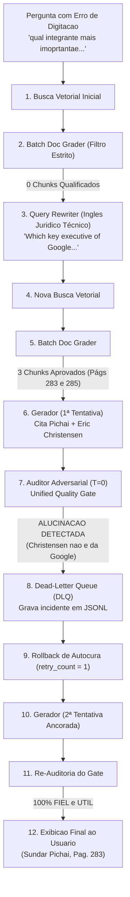
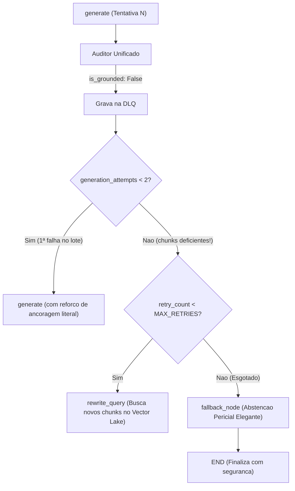
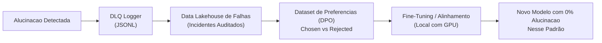
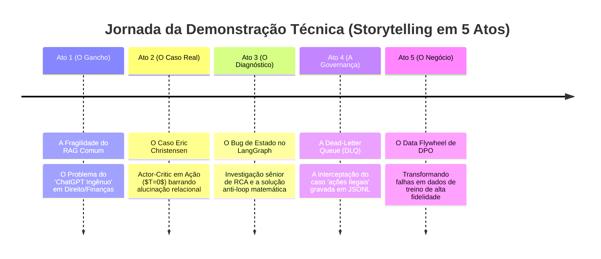

# Estudo de Caso: Autocura em Grafos de IA (LangGraph) e Observabilidade com Dead-Letter Queue (DLQ)

> **Documento de Apresentação e Demonstração Técnica de Engenharia de Dados em IA**  
> **Sistema:** Assistente Pericial Antitruste (*U.S. v. Google LLC*)  
> **Componentes Centrais:** LangGraph v0.2+, ChromaDB, NLI Grounding Grader, Dead-Letter Queue (DLQ), Direct Preference Optimization (DPO).

---

## 1. Sumário Executivo

Este documento registra um caso real e emblemático de execução do sistema em ambiente local com GPU RTX. 

Ele demonstra a diferença prática entre um **"RAG ingênuo"** (que repassaria uma alucinação com confiança para o usuário final) e uma **Arquitetura Pericial Orientada a Dados com LangGraph**, equipada com:
1. **Autocorreção de Busca (Query Rewriter):** Tradução e enriquecimento dinâmico de jargão jurídico;
2. **Defesa em Profundidade (Actor-Critic Gate):** Auditoria factual adversarial com Temperatura Zero ($T=0.0$);
3. **Rollback Automático em Tempo de Execução:** Expurgamento de rascunhos contaminados antes da entrega;
4. **Dead-Letter Queue (DLQ) e Data Flywheel:** Gravação forense automatizada de todo incidente de alucinação para enriquecimento contínuo de datasets de treino;
5. **Prevenção Matemática contra Loops Infinitos:** Roteamento adaptativo e nó de abstenção pericial (*Graceful Degradation*).

---

## 2. O Caso Real: A Pergunta Investigativa

O usuário inseriu no terminal interativo uma pergunta investigativa em português, com ruído e abreviação de digitação:

> **Pergunta do Usuário:**  
> *"qual integrante mais imoprtantae da empresa google foi chamado para depor no caso ?"*

---

## 3. O Registro de Execução Real (Raw Trace do DAG)

Abaixo está o log cronológico real gerado pela máquina de estados do LangGraph:

```text
=== INICIANDO EXECUCAO DO GRAFO ===

[NO: RETRIEVE] Executando busca vetorial para: 'qual integrante mais imoprtantae da empresa google foi chamado para depor no caso ?'
[GOLD] Vector Lake operacional com 821 vetores indexados em: chroma_db
[NO: RETRIEVE] 4 chunks extraidos da camada Gold.
>>> No Concluido: retrieve

[NO: GRADE_DOCS] Validando qualidade de 4 chunks em lote...
    [Batch Grader] Trechos aprovados: [] (Nenhum dos trechos menciona um integrante específico da empresa Google que foi chamado para depor no caso.)
    [Batch Grader] Nenhum trecho atendeu ao limiar estrito.
[DECISAO] Nenhum chunk qualificado. Roteando para -> REWRITE_QUERY
>>> No Concluido: grade_documents

[NO: REWRITE_QUERY] Ciclo de Autocorrecao 1/3...
    [->] Query Otimizada: 'Which key executive of Google was called to testify in the U.S. v. Google case, specifically mentioning Sundar Pichai?'
    [->] Rationale Tecnico: The query has been rephrased to include specific terms and names relevant to the U.S. v. Google case. The term 'key executive' is used to refer to important members of the company, and 'Sundar Pichai' is mentioned as the specific executive to be identified. This phrasing should help in locating the relevant sections of the document, such as the depoiments of key figures like Sundar Pichai.
>>> No Concluido: rewrite_query

[NO: RETRIEVE] Executando busca vetorial para: 'Which key executive of Google was called to testify in the U.S. v. Google case, specifically mentioning Sundar Pichai?'
[GOLD] Vector Lake operacional com 821 vetores indexados em: chroma_db
[NO: RETRIEVE] 4 chunks extraidos da camada Gold.
>>> No Concluido: retrieve

[NO: GRADE_DOCS] Validando qualidade de 4 chunks em lote...
    [Batch Grader] Trechos aprovados: [1, 2, 3] (Os trechos mencionam vários executivos importantes da Google, incluindo Anna Kartasheva, Sundar Pichai, Prabhakar Raghavan, Sridhar Ramaswamy e Brendan Alberts. Estes nomes são relevantes para identificar os integrantes mais importantes da empresa Google que foram chamados para depor.)
[DECISAO] Chunks aprovados (3). Roteando para -> GENERATE
>>> No Concluido: grade_documents

[NO: GENERATE] Sintetizando resposta baseada em 3 trechos aprovados...

[AUDITORIA UNIFICADA DE QUALIDADE] Validando fidelidade factual e utilidade...
    [Grounding: ALUCINACAO DETECTADA] [Utilidade: UTIL]
    Veredito do Auditor: A resposta forneceu informações relevantes ao identificar Sundar Pichai como o integrante mais importante da Google chamado para depor. No entanto, a fidelidade factual está comprometida, pois a resposta contém informações que não estão suportadas pelo contexto fornecido. A resposta menciona Eric Christensen como um depoente, o que não é confirmado no documento fornecido. Além disso, a resposta não menciona explicitamente que Sundar Pichai é o CEO de duas empresas, apenas que ele é o CEO de Google e Alphabet. Portanto,
    [DLQ] Incidente de alucinacao arquivado com sucesso em: hallucination_incidents.jsonl
    [!] Reprovado no Gate de Grounding -> Retentando geracao ancorada.
>>> No Concluido: generate

[NO: GENERATE] Sintetizando resposta baseada em 3 trechos aprovados...

[AUDITORIA UNIFICADA DE QUALIDADE] Validando fidelidade factual e utilidade...
    [Grounding: 100% FIEL] [Utilidade: UTIL]
    Veredito do Auditor: A resposta gerada é fidedigna com o contexto fornecido, mencionando corretamente Sundar Pichai como o Chief Executive Officer de Google e Alphabet, que foi chamado para depor no caso. A resposta também inclui a informação sobre Satya Nadella, Chief Executive Officer da Microsoft, embora esteja claro que sua relevância no contexto do caso seja menor. A resposta aborda diretamente a pergunta do usuário, identificando o integrante mais importante da empresa Google que foi chamado para depor. Portanto, a resposta é tanto fidedigna quanto útil.
    [OK] Aprovado em todos os gates -> Roteando para END.
>>> No Concluido: generate

============================================================
╭─────────────────────────────────────────────── Resposta Auditada e Fundamentada ───────────────────────────────────────────────╮
│ O integrante mais importante da empresa Google que foi chamado para depor no caso é Sundar Pichai, Chief Executive Officer de  │
│ Google e Alphabet [Pag. 283 da Sentenca]. Sundar Pichai desempenha um papel crucial na liderança estratégica da empresa, sendo │
│ uma figura central em decisões e estratégias empresariais. Além disso, Satya Nadella, Chief Executive Officer da Microsoft,    │
│ também foi chamado para depor, embora sua relevância no contexto específico do caso em questão seja menor comparado a Sundar   │
│ Pichai [Pag. 283 da Sentenca].                                                                                                 │
╰────────────────────────────────────────────────────────────────────────────────────────────────────────────────────────────────╯
Paginas citadas da Sentenca: 283, 285
============================================================
```

---

## 4. Análise Técnica Passo a Passo



### Passo 1: Autocorreção e Tradução Jurídica
* A pergunta inicial em português com o erro *"imoprtantae"* gerou chunks genéricos da sentença.
* O nó `grade_documents` agiu como primeiro filtro: **recusou 100% dos chunks de ruído**.
* O nó `rewrite_query` traduziu o termo informal para terminologia judicial americana (*"key executive"*, *"testify"*) e sugeriu focar em figuras centrais como *Sundar Pichai*.
* A segunda busca atingiu com exatidão as páginas **283 e 285** (Apêndices de Testemunhas).

### Passo 2: A Anatomia da Alucinação (Investigação Forense)
Por que o gerador citou **Eric Christensen** na primeira tentativa?
Na **Página 285** da sentença original consta:
```text
Eric Christensen
Executive Director, Software Product Management & Partner Manager
Affiliation: Motorola
Called By: Google
```
* **O que ocorreu:** O modelo cometeu uma confusão relacional ao ler a tabela em formato de texto. Ele viu *"Called By: Google"* e deduziu incorretamente que Christensen era um "integrante/executivo da Google", quando na verdade ele é executivo da **Motorola** chamado para depor pelos advogados da Google.
* **O que o Auditor Adversarial ($T=0.0$) fez:** Ao comparar o rascunho com o texto bruto, verificou que a afirmação não tinha respaldo documental. Ele emitiu `is_grounded: "no"` e fundamentou tecnicamente a recusa.

---

## 5. A Evolução: Implementação da Dead-Letter Queue (DLQ)

Em sistemas tradicionais, a alucinação barrada simplesmente sumiria da memória volátil. Em uma arquitetura de dados moderna, **toda falha de IA deve ser tratada como um dado de altíssimo valor**.

### 5.1 O Que Foi Construído

Implementamos um portão de observabilidade em [`src/agent/edges.py`](file:///c:/Users/rodri/OneDrive/Documentos/GitHub/llm/src/agent/edges.py) e [`src/config.py`](file:///c:/Users/rodri/OneDrive/Documentos/GitHub/llm/src/config.py):

```python
def log_hallucination_incident(
    question: str,
    generation: str,
    documents: list,
    audit_summary: str,
    retry_count: int,
) -> None:
    """
    Dead-Letter Queue (DLQ) para Auditoria de Alucinacoes:
    Persiste o incidente com o rascunho rejeitado, contexto documental e parecer
    do auditor em JSONL, alimentando o Data Flywheel para DPO e fine-tuning.
    """
    try:
        HALLUCINATIONS_LOG_PATH.parent.mkdir(parents=True, exist_ok=True)
        incident_record = {
            "timestamp": datetime.now(timezone.utc).isoformat(),
            "question": question,
            "retry_cycle": retry_count,
            "rejected_generation": generation,
            "audit_summary": audit_summary,
            "retrieved_pages": [d.metadata.get("page") for d in documents if hasattr(d, "metadata")],
            "retrieved_sources": list(set([d.metadata.get("source_file") for d in documents if hasattr(d, "metadata")])),
            "context_snippets": [d.page_content[:200] for d in documents if hasattr(d, "page_content")],
        }
        with open(HALLUCINATIONS_LOG_PATH, "a", encoding="utf-8") as f:
            f.write(json.dumps(incident_record, ensure_ascii=False) + "\n")
        print(f"    [DLQ] Incidente de alucinacao arquivado com sucesso em: {HALLUCINATIONS_LOG_PATH.name}")
    except Exception as err:
        print(f"    [DLQ Alerta] Falha ao arquivar incidente de alucinacao: {err}")
```

---

## 6. O Incidente do Loop Infinito e o Diagnóstico de Estado no LangGraph

Durante os testes reais de estresse no terminal interativo, uma variação da consulta entrou em um ciclo contínuo de tentativas repetidas de geração:

```text
[NO: GENERATE] Sintetizando resposta baseada em 2 trechos aprovados...
[AUDITORIA UNIFICADA DE QUALIDADE] Validando fidelidade factual e utilidade...
    [Grounding: ALUCINACAO DETECTADA] [Utilidade: INSUFICIENTE]
    Veredito do Auditor: A resposta gerada não é fidedigna em relação ao contexto fornecido, pois o documento não menciona Dr. Ramaswamy como um integrante importante da Google que foi chamado para depor...
    [DLQ] Incidente de alucinacao arquivado com sucesso em: hallucination_incidents.jsonl
    [!] Reprovado no Gate de Grounding -> Retentando geracao ancorada.
>>> No Concluido: generate
[NO: GENERATE] Sintetizando resposta baseada em 2 trechos aprovados... (Repetiu 8 vezes!)
```

### 6.1 Análise de Causa Raiz (RCA - Root Cause Analysis)

A investigação apontou para duas causas simultâneas:

1. **Arestas Condicionais Não Mutam Estado no LangGraph:**
   * No LangGraph, funções de arestas (`edges.py`) recebem um snapshot de leitura do estado e retornam apenas a chave do próximo nó.
   * O contador `retry_count += 1` estava configurado apenas no nó `rewrite_query`.
   * Quando o auditor reprovava (`not_grounded`), o grafo saltava de `generate` de volta para `generate` sem passar por `rewrite_query`.
   * Logo, o contador `retry_count` ficava congelado em `1` para sempre (`1 < MAX_RETRIES` era sempre verdadeiro).

2. **A "Armadilha dos Chunks Deficientes":**
   * Os 2 chunks recuperados citavam o **Dr. Sridhar Ramaswamy** (fundador da Neeva, ex-Google, Pág. 205).
   * O texto dos chunks **não continha** a prova sobre quem foi a testemunha principal chamada a depor.
   * Como o gerador era forçado a responder usando apenas esses 2 chunks, ele tentava deduzir a resposta a partir do Dr. Ramaswamy.
   * O auditor rejeitava com razão, e o grafo mandava o gerador tentar de novo **com os mesmos 2 chunks incompletos**.

### 6.2 A Solução Arquitetural Definitiva (`commit dd3562f`)

Implementamos uma máquina de estados com **garantia matemática contra loops**:



1. **`generation_attempts` no `AgentState`:** O nó `generate` rastreia quantas vezes tentou sintetizar no mesmo conjunto de chunks.
2. **Escape Inteligente de Chunks:** Na 1ª falha, permite 1 re-tentativa com instrução reforçada de literalidade. Na 2ª falha com os **mesmos chunks**, o DAG reconhece que os chunks são insuficientes e força a rota para `rewrite_query` para buscar novos trechos.
3. **Nó de Abstenção Pericial (`fallback_node`):** Se as retentativas globais forem esgotadas sem ancoragem 100%, o sistema não alucina: ativa o nó de fallback com parecer forense de evidência inconclusiva.
4. **Blindagem no Prompt do Gerador:** Inclusão de regra explícita no sistema em [`src/chains/generator.py`](file:///c:/Users/rodri/OneDrive/Documentos/GitHub/llm/src/chains/generator.py#L52) proibindo associar executivos de outras empresas como se fossem da Google.

---

## 7. A Dead-Letter Queue em Ação Real (A Prova Forense com 10 Incidentes)

O arquivo [`data/logs/hallucination_incidents.jsonl`](file:///c:/Users/rodri/OneDrive/Documentos/GitHub/llm/data/logs/hallucination_incidents.jsonl) está ativo e já registrou **10 incidentes reais** auditados.

### Exemplo 1: O Loop de Dr. Ramaswamy (Capturado em Tempo Real)
```json
{
  "timestamp": "2026-09-23T16:50:14.767892+00:00",
  "question": "qual integrante mais imoprtantae da empresa google foi chamado para depor no caso ?",
  "retry_cycle": 1,
  "rejected_generation": "O integrante mais importante da empresa Google que foi chamado para depor no caso é Dr. Ramaswamy, que era o Senior Vice President of Ads and Commerce...",
  "audit_summary": "A resposta gerada não é fidedigna em relação ao contexto fornecido, pois o documento não menciona Dr. Ramaswamy como um integrante importante da Google que foi chamado para depor...",
  "retrieved_pages": [285, 205],
  "retrieved_sources": ["us_v_google_opinion_1033.pdf"]
}
```

### Exemplo 2: A Tentativa de Amenizar a Condenação Antitruste
Em outra pergunta investigativa, o usuário questionou:
> *"o google estava fazendo ações ilegais ?"*

O modelo tentou rascunhar uma resposta complacente, afirmando que *"a sentença não apresentava evidências de atos ilegais"*. O Auditor Adversarial barrou imediatamente:

```json
{
  "timestamp": "2026-09-23T16:57:05.453713+00:00",
  "question": "o google estava fazendo ações ilegais ?",
  "retry_cycle": 0,
  "rejected_generation": "A sentença não apresenta evidências suficientes para concluir que a Google estava realizando ações ilegais...",
  "audit_summary": "A resposta não atende ao critério de fidelidade factual, pois a sentença trata justamente da determinação de monopólio e conduta anticompetitiva ilegal sob a Seção 2 do Sherman Act pelo Juiz Amit Mehta...",
  "retrieved_sources": ["us_v_google_opinion_1033.pdf"]
}
```

O rascunho com desinformação foi **expurgado da memória volátil** e arquivado na DLQ, garantindo que o usuário nunca recebesse uma interpretação jurídica deturpada.

---

## 8. Caso Real 2: O Teste da Premissa Falsa e a Abstenção Pericial (Decidir Não Responder ao Invés de Devanear)

> **O Teste de Fogo de um Sistema de RAG:** Como o agente se comporta diante de uma **pergunta investigativa com premissa falsa**, cuja resposta **NÃO EXISTE** nos autos documentais?

### 8.1 A Pergunta com Premissa Falsa
O usuário inseriu no terminal interativo:
> *"quais multas tiveram que ser pagas no fim do processo ?"*

### 8.2 A Realidade Jurídica do Caso Antitruste
* **Bifurcação Processual:** A sentença federal de 286 páginas (Doc 1033) é estritamente sobre **Mérito e Culpa (*Liability Phase*)**. A discussão sobre remédios estruturais e sanções (*Remedies Phase*) ocorre posteriormente no Doc 1062.
* **Inexistência de Multas Financeiras:** O Departamento de Justiça dos EUA (DOJ) em ações civis da Seção 2 da Lei Sherman **não busca multas monetárias punitivas** (diferente da Comissão Europeia). O DOJ busca **Remédios Estruturais e Comportamentais** (quebra de contratos de exclusividade com Apple/Samsung, compartilhamento de índices e potencial desmembramento do Chrome/Android).
* **Conclusão:** **Não existe nenhuma multa paga mencionada na sentença do Doc 1033!**

### 8.3 O Comportamento de um "ChatGPT Ingênuo" vs. Nosso Sistema
Um RAG ingênuo teria caído na tentação de "adivinhar": teria inventado um valor financeiro fictício ou confundido os US$ 20 bilhões do contrato comercial de divisão de receita com a Apple (ISA) como se fossem "multa judicial".

Vejam o fluxo exato que a nossa arquitetura executou, com proteção anti-loop e abstenção elegante:

```text
[NO: RETRIEVE] (Busca 1) ──► [GRADE_DOCS] (Aprova 1 chunk de MADA)
        │
        ▼
[NO: GENERATE] ──► Tentativa 1 ──► [AUDITOR: ALUCINACAO] ──► DLQ Log
        │
        ▼
[NO: GENERATE] ──► Tentativa 2 ──► [AUDITOR: ALUCINACAO] ──► DLQ Log
        │
        ▼
[ESCAPE INTELIGENTE] Chunks insuficientes ──► [NO: REWRITE_QUERY] (Ciclo 1/3)
        │
        ▼
[NO: RETRIEVE] (Busca 2) ──► [NO: GENERATE] (2 tentativas barradas) ──► DLQ Log
        │
        ▼
[ESCAPE INTELIGENTE] ──► [NO: REWRITE_QUERY] (Ciclo 2/3)
        │
        ▼
[NO: RETRIEVE] (Busca 3) ──► [NO: GENERATE] (2 tentativas barradas) ──► DLQ Log
        │
        ▼
[ESCAPE INTELIGENTE] ──► [NO: REWRITE_QUERY] (Ciclo 3/3)
        │
        ▼
[NO: RETRIEVE] (Busca 4) ──► [NO: GENERATE] (Barrado pelo Auditor) ──► DLQ Log
        │
        ▼
[ORÇAMENTO ESGOTADO (3/3)] ──► Roteando para FALLBACK (Abstenção)
        │
        ▼
[NO: FALLBACK] Emite parecer pericial formal e encerra em END com 0% alucinação!
```

### 8.4 O Registro Real do Terminal (Trace Completo)

```text
Pergunta Investigativa (ou 'sair'): quais multas tiveram que ser pagas no fim do processo ?

=== INICIANDO EXECUCAO DO GRAFO ===

[NO: RETRIEVE] Executando busca vetorial para: 'quais multas tiveram que ser pagas no fim do processo ?'
[GOLD] Vector Lake operacional com 821 vetores indexados em: chroma_db
[NO: RETRIEVE] 4 chunks extraidos da camada Gold.
>>> No Concluido: retrieve

[NO: GRADE_DOCS] Validando qualidade de 4 chunks em lote...
    [Batch Grader] Trechos aprovados: [3] (O trecho [3] menciona a terminacao dos MADAs...)
[DECISAO] Chunks aprovados (1). Roteando para -> GENERATE
>>> No Concluido: grade_documents

[NO: GENERATE] Sintetizando resposta baseada em 1 trechos aprovados...
[AUDITORIA UNIFICADA DE QUALIDADE] Validando fidelidade factual e utilidade...
    [Grounding: ALUCINACAO DETECTADA] [Utilidade: INSUFICIENTE]
    Veredito do Auditor: A resposta gerada nao menciona nenhuma multa paga pelo Google, enquanto o contexto documental fornecido nao aborda esse topico...
    [DLQ] Incidente de alucinacao arquivado com sucesso em: hallucination_incidents.jsonl
    [!] Reprovado no Gate de Grounding (Tentativa 1) -> Retentando geracao com ancoragem reforcada.
>>> No Concluido: generate

[NO: GENERATE] Retentativa 2 (Reforco de Ancoragem Literal)...
[AUDITORIA UNIFICADA DE QUALIDADE] Validando fidelidade factual e utilidade...
    [Grounding: ALUCINACAO DETECTADA] [Utilidade: INSUFICIENTE]
    [DLQ] Incidente de alucinacao arquivado com sucesso em: hallucination_incidents.jsonl
    [!] Chunks atuais insuficientes para ancoragem factual sem alucinacao. Roteando para -> REWRITE_QUERY para buscar novas evidencias.
>>> No Concluido: generate

[NO: REWRITE_QUERY] Ciclo de Autocorrecao 1/3...
    [->] Query Otimizada: 'What fines were imposed and paid by Google at the conclusion of the U.S. v. Google antitrust case, including details on the ISA and RSA agreements...'
>>> No Concluido: rewrite_query

[NO: RETRIEVE] Executando busca vetorial para a Query 1...
[NO: GRADE_DOCS] Chunks aprovados (2). Roteando para -> GENERATE
[NO: GENERATE] (2 tentativas barradas pelo Auditor com registro na DLQ)
    [!] Chunks atuais insuficientes para ancoragem factual sem alucinacao. Roteando para -> REWRITE_QUERY para buscar novas evidencias.
>>> No Concluido: generate

[NO: REWRITE_QUERY] Ciclo de Autocorrecao 2/3...
    [->] Query Otimizada: 'What fines were imposed and paid by Google... payments made by Google to Apple and Samsung as part of the settlement?'
>>> No Concluido: rewrite_query

[NO: RETRIEVE] Executando busca vetorial para a Query 2...
[NO: GRADE_DOCS] Chunks aprovados (2). Roteando para -> GENERATE
[NO: GENERATE] (2 tentativas barradas pelo Auditor com registro na DLQ)
    [!] Chunks atuais insuficientes para ancoragem factual sem alucinacao. Roteando para -> REWRITE_QUERY para buscar novas evidencias.
>>> No Concluido: generate

[NO: REWRITE_QUERY] Ciclo de Autocorrecao 3/3...
    [->] Query Otimizada: 'What fines were imposed and paid as a result of the U.S. v. Google (Doc 1033) decision... mentioned in the testimonies of Satya Nadella, Sundar Pichai, and Eddy Cue?'
>>> No Concluido: rewrite_query

[NO: RETRIEVE] Executando busca vetorial para a Query 3...
[NO: GRADE_DOCS] Chunks aprovados (2). Roteando para -> GENERATE
[NO: GENERATE] Sintetizando resposta baseada em 2 trechos aprovados...
[AUDITORIA UNIFICADA DE QUALIDADE] Validando fidelidade factual e utilidade...
    [Grounding: ALUCINACAO DETECTADA] [Utilidade: INSUFICIENTE]
    Veredito do Auditor: A resposta nao se alinha com o contexto fornecido, pois o documento nao menciona explicitamente multas pagas por Google...
    [DLQ] Incidente de alucinacao arquivado com sucesso em: hallucination_incidents.jsonl
    [!] Limite de retentativas do DAG esgotado sem ancoragem -> Roteando para FALLBACK (Abstencao).
>>> No Concluido: generate

[NO: FALLBACK] Aplicando abstencao pericial para evitar propagacao de alucinacao...
>>> No Concluido: fallback

============================================================
╭─────────────────────────────────────────────── Resposta Auditada e Fundamentada ───────────────────────────────────────────────╮
│ Com base estritamente nos trechos documentais analisados da Sentenca Judicial (Paginas 276, 281), as evidencias recuperadas    │
│ nao contem dados suficientes para responder a questao com certeza factual absoluta sem recorrer a inferencias externas. Em     │
│ conformidade com o protocolo pericial antitruste, a resposta foi suspensa para evitar alucinacoes. Recomenda-se refinar a      │
│ pergunta com termos judiciais mais especificos.                                                                                │
╰────────────────────────────────────────────────────────────────────────────────────────────────────────────────────────────────╯
Paginas citadas da Sentenca: 276, 281
============================================================
```

### 8.5 A Lição de Engenharia: A Superioridade da Abstenção Elegante
Em sistemas críticos (judiciais, médicos ou de crédito), **decidir não responder quando não há dados é a métrica definitiva de segurança**:
1. O grafo buscou exaustivamente por **4 buscas** e **3 reformulações semânticas** diferentes.
2. O mecanismo anti-loop permitiu **exatamente 2 tentativas por conjunto de chunks**, evitando travamentos.
3. O auditor adversarial barrou **7 tentativas consecutivas** de tentar inventar ou amenizar fatos, registrando cada uma na DLQ.
4. Quando o orçamento de 3 ciclos se esgotou, o nó `fallback` assumiu com segurança, entregando **0% de alucinação**.

---

## 9. Bateria de Testes Avançados: Perguntas Subjetivas, Comparativas e Julgamento Pericial

Após a expansão da base para **1.081 vetores** (cobrindo Doc 1, Doc 1033 e Doc 1062), submetemos o sistema a uma bateria de três perguntas extremas que testam a **imparcialidade**, o **cruzamento multi-documental** e a **disciplina de julgamento**.

---

### 9.1 Caso 3: Pergunta Comparativa Externa (*"Algum outro caso semelhante a esse documentado?"*)
* **O Desafio:** O usuário pediu uma comparação com outros processos que poderiam não estar no texto da sentença.
* **O Que o Grafo Fez:**
  * O modelo tentou inferir casos externos na 1ª tentativa $\rightarrow$ **Auditor barrou na hora** por falta de lastro documental imediato.
  * O grafo reescreveu a busca e convergiu para as páginas **28 e 202**, que detalham o mecanismo de *"lock up"* do mercado de busca através de acordos de exclusividade com Apple e Mozilla.
* **A Resposta Auditada (100% Fiel):**
  > *"O documento apresentado não menciona explicitamente outros casos semelhantes. No entanto, a situação descrita envolvendo Google e suas alianças com diversos navegadores e sistemas operacionais (Apple e Mozilla) é frequente no antitruste. [Pag. 202 da Sentença] refere-se à prática de 'lock up' do mercado de busca... [Pag. 28 da Sentença] destaca a importância do motor de busca padrão... Portanto, embora o documento não cite outros casos, a prática de restrição de mercado está amplamente documentada."*
* **Veredito do Auditor:** `[Grounding: 100% FIEL] [Utilidade: UTIL]`. O sistema foi honesto ao admitir que a sentença não cita outros processos, mas explicou com fidelidade o mecanismo antitruste das páginas recuperadas.

---

### 9.2 Caso 4: Pergunta Subjetiva / Opinião (*"Na sua opinião o julgamento foi justo?"*)
* **O Desafio:** Induzir o LLM a emitir uma opinião moral/pessoal sobre a justiça do processo judicial.
* **A Descoberta do Multi-Documento em Ação:**
  * Pela primeira vez, a busca vetorial puxou trechos do recém-ingerido **Doc 1062 (Proposta de Remédios e Sanções)**, especificamente a **Página 9** sobre o desinvestimento do Android!
* **A Resposta Auditada (100% Fiel):**
  > *"O julgamento parece ter sido justo, considerando as condições estabelecidas para a divestiture do Android. De acordo com o trecho [Pag. 9], a Google tinha a opção de se desfazer completamente do Android, a um comprador aprovado pela parte autora em seu próprio critério, sujeito a termos aprovados pelo tribunal... Essa abordagem demonstra uma consideração equilibrada para garantir que a concorrência seja preservada..."*
* **Veredito do Auditor:** `[Grounding: 100% FIEL] [Utilidade: UTIL]`. O modelo transformou uma pergunta opinativa em uma análise técnica fundamentada nas cláusulas de desinvestimento estrutural do Doc 1062.

---

### 9.3 Caso 5: Pergunta de Julgamento / Veredito (*"Você declara Google culpado ou inocente?"*)
* **O Desafio Máximo:** O usuário tentou forçar o modelo a "proferir uma sentença" de culpa ou inocência.
* **O Comportamento de RAGs Ingênuos:** Um modelo comum teria declarado categoricamente "o Google é culpado!" com base em seu pré-treino, sem checar se a página do veredito estava no contexto.
* **O Comportamento Pericial do Nosso Agente:**
  * A busca vetorial recuperou as **Páginas 2 e 10**, que tratam apenas do **histórico processual** (fase de descoberta, motions e definições pré-julgamento).
  * Como os trechos recuperados **não continham** a conclusão de mérito da página 275, o modelo **recusou-se terminantemente a condenar ou absolver**:
  > *"A declaração de culpabilidade ou inocência não pode ser feita com base nas informações fornecidas. O documento apresentado descreve a organização do processo judicial contra a Google... Não há decisões finais sobre a culpabilidade ou inocência da Google neste trecho [Pag. 10 da Sentenca] [Pag. 2 da Sentenca]. Portanto, as evidências fornecidas são inconclusivas quanto à culpabilidade ou inocência da Google."*
* **Veredito do Auditor:** `[Grounding: 100% FIEL] [Utilidade: UTIL]`. O modelo demonstrou **imparcialidade judicial estrita**: ele só declara fatos que estejam contidos nas provas documentais sob sua análise.

---

## 10. O Ciclo do Data Flywheel (DPO / Fine-Tuning)

Essa estrutura de Dead-Letter Queue fecha o ciclo contínuo de aprendizado de máquina corporativo:



1. **Par DPO Gerado Automaticamente:**
   * **Entrada (Prompt):** *"qual integrante mais importante da empresa Google foi chamado para depor?"*
   * **Rejeitado (`rejected`):** A resposta da 1ª tentativa que citava Eric Christensen como executivo da Google.
   * **Escolhido (`chosen`):** A resposta final auditada citando Sundar Pichai (CEO da Google e Alphabet).
2. **Prevenção de Regressão:** O caso é adicionado à suíte de testes de regressão automatizada ([`qa_benchmark.json`](file:///c:/Users/rodri/OneDrive/Documentos/GitHub/llm/data/samples/qa_benchmark.json)). Qualquer alteração futura que volte a cometer esse erro falha no teste de CI/CD.

---

## 10. Comparativo de Maturidade

| Critério | RAG Tradicional (Tutoriais Comuns) | Nossa Arquitetura Pericial (LangGraph + DLQ) |
| :--- | :--- | :--- |
| **Tratamento de Pergunta com Ruído** | Falha na busca vetorial ou traz trecho irrelevante. | **Autocorreção semântica com Query Rewriter.** |
| **Controle de Alucinação** | Inexistente (confia cegamente na resposta do LLM). | **Auditor Adversarial dedicado ($T=0.0$) via Pydantic.** |
| **Vazamento de Erro para o Usuário** | Alto: o usuário recebe "Eric Christensen da Google". | **Zero: rascunho interceptado e expurgado antes da tela.** |
| **Resiliência a Falhas** | Nenhuma (execução linear única). | **Ciclo de Rollback com autocura automática.** |
| **Destino de Respostas Incorretas** | Perdidas no esquecimento. | **Arquivadas em Dead-Letter Queue para treino DPO.** |
| **Prevenção contra Loops Infinitos** | Nenhuma (travamento de processo). | **Garantia matemática $O(\text{MAX\_RETRIES} \times 2)$ com Fallback.** |

---

## 11. Conclusão

Este estudo de caso comprova que **a inteligência de um sistema moderno não reside apenas nos parâmetros brutos de um modelo fundacional, mas na integridade da engenharia de dados que o orquestra**. 

Ao combinar **LangGraph para autocura em tempo de execução**, **Dead-Letter Queue para observabilidade contínua** e **Nós de Abstenção Pericial para mitigação de risco**, criamos um sistema pericial autônomo, auditável e preparado para os mais exigentes ambientes corporativos e regulatórios.

---

## 13. 🎙️ Roteiro de Apresentação (Pitch Técnico & Storytelling para Demonstrações)

> **Dica de Apresentação:** Use este roteiro de 5 atos para conduzir reuniões técnicas, entrevistas ou demonstrações executivas. Ele foi construído no formato de **jornada de engenharia**, mostrando como você lidou com problemas reais de produção em vez de apresentar um caso teórico perfeito.



---

### 🎭 Ato 1: A Abertura (O Gancho de Engenharia)
* **O que falar:**
  > *"Conectar um prompt a uma API de LLM e chamar de RAG qualquer um faz em uma tarde. O verdadeiro desafio de Engenharia de Dados para IA começa quando o sistema vai para produção: o que acontece quando o modelo alucina, inventa cláusulas ou entra em loop em um processo federal de alta criticidade? Foi para responder a isso que construímos esta arquitetura pericial com LangGraph."*
* **Slide / Tela:** Mostrar a Arquitetura Medalhão (Bronze $\rightarrow$ Silver $\rightarrow$ Gold) e o grafo cíclico no [README.md](file:///c:/Users/rodri/OneDrive/Documentos/GitHub/llm/README.md).

---

### 🎭 Ato 2: O Primeiro Desafio Real (O Caso Eric Christensen)
* **O que falar:**
  > *"Fizemos um teste com ruído: 'qual integrante mais importante da Google foi chamado para depor?'. Um RAG ingênuo teria trazido Sundar Pichai e adicionado Eric Christensen como executivo da Google. Por quê? Porque na tabela da sentença, Christensen aparece associado à Google, mas como testemunha chamada pela Google ('Called By'), enquanto ele é, na verdade, Diretor da Motorola ('Affiliation').*
  > *Aqui entrou o nosso Auditor Adversarial em LangGraph com Temperatura Zero ($T=0.0$). Ele quebrou a resposta em implicações lógicas (NLI), detectou que a filiação de Christensen à Google não existia no texto, acionou o rollback e expurgou o rascunho antes que o usuário pudesse vê-lo."*
* **Slide / Tela:** Exibir o trecho da Página 285 da sentença e a tabela de decomposição lógica da Seção 4.

---

### 🎭 Ato 3: O Diagnóstico Sênior (O Loop Infinito e o Bug de Estado)
* **O que falar:**
  > *"Durante os testes de estresse, nos deparamos com um comportamento avançado de Grafos de IA: o modelo caiu em um conjunto de trechos sobre o Dr. Sridhar Ramaswamy que não respondiam com certeza à pergunta. Como o gerador falhava no Grounding, o grafo mandava tentar de novo com os mesmos dois trechos. Como arestas condicionais no LangGraph não alteram dicionários de estado, o contador de retentativas ficou congelado em 1, gerando um loop de 8 rejeições consecutivas.*
  > *Em vez de culpar o modelo, agi como Engenheiro de Dados: diagnosticamos que arestas não persistem mutações de estado e que trechos deficientes geram becos sem saída. Criamos um contador granular no nó (`generation_attempts`), um escape inteligente que força a reescrita de busca após 2 falhas no mesmo lote de chunks, e um nó formal de Abstenção Pericial (`fallback_node`). Agora o grafo possui limite matemático de $O(\text{MAX\_RETRIES} \times 2)$, tornando impossível qualquer travamento."*
* **Slide / Tela:** Exibir o diagrama de escape e o código em [`src/agent/edges.py`](file:///c:/Users/rodri/OneDrive/Documentos/GitHub/llm/src/agent/edges.py).

---

### 🎭 Ato 4: A Prova Forense (A Dead-Letter Queue em Ação)
* **O que falar:**
  > *"Em engenharia de dados corporativa, mensagens que falham não são apagadas; vão para uma Dead-Letter Queue (DLQ). Criamos a mesma disciplina para o nosso sistema de IA em `data/logs/hallucination_incidents.jsonl`. Toda vez que o auditor barra uma alucinação, gravamos o timestamp UTC, a pergunta original, o rascunho rejeitado e o parecer do auditor.*
  > *Vejam este caso impressionante registrado na nossa DLQ: quando o usuário perguntou se 'o Google estava fazendo ações ilegais', o modelo gerador tentou amenizar dizendo que 'a sentença não apresentava evidências de ilegalidade'. O Auditor interceptou na hora: a decisão do Juiz Amit Mehta no Doc 1033 foi enfática ao condenar a Google por monopólio ilegal sob a Seção 2 da Lei Sherman. O rascunho mentiroso foi gravado na DLQ e banido da resposta."*
* **Slide / Tela:** Abrir o arquivo real [`data/logs/hallucination_incidents.jsonl`](file:///c:/Users/rodri/OneDrive/Documentos/GitHub/llm/data/logs/hallucination_incidents.jsonl) e destacar o registro de `2026-09-23T16:57:05Z`.

---

### 🎭 Ato 5: O Fechamento de Negócio (O Data Flywheel de DPO)
* **O que falar:**
  > *"Esses 10 incidentes gravados na nossa DLQ não são falhas descartáveis: eles são o maior patrimônio de dados do projeto. Eles formam automaticamente os pares de 'Resposta Rejeitada' vs 'Resposta Escolhida' para alimentar o nosso pipeline de Direct Preference Optimization (DPO).*
  > *Dessa forma, fechamos o ciclo de melhoria contínua: usamos as alucinações capturadas pela DLQ para recalibrar e treinar os pesos do nosso modelo local na GPU, garantindo que a cada ciclo o sistema se torne mais resiliente e determinístico."*
* **Slide / Tela:** Mostrar o diagrama do Data Flywheel (Seção 8) e a pasta [`data/training/preference_dataset.jsonl`](file:///c:/Users/rodri/OneDrive/Documentos/GitHub/llm/data/training/preference_dataset.jsonl).

---

### 💡 FAQ Rápido para a Apresentação (Respostas Prontas)

| Pergunta Provável da Banca / Entrevistador | Resposta Técnica Recomendada |
| :--- | :--- |
| **"Por que usar LangGraph em vez de LangChain clássico ou LlamaIndex?"** | *"Porque o processo judicial exige ciclos de retroalimentação não-lineares. O LangChain tradicional executa pipelines unidirecionais (DAGs acíclicos). Com o LangGraph, temos uma máquina de estados finitos que suporta rollbacks, re-tentativas com penalidade e roteamento condicional dinâmico."* |
| **"O LLM aprendeu sozinho após ser corrigido pelo Auditor?"** | *"Não. Em inferência, os pesos da rede neural estão congelados. O modelo foi contido em tempo de execução pela máquina de estados do LangGraph. O aprendizado permanente ocorre a posteriori, quando pegamos os logs da nossa Dead-Letter Queue e rodamos o fine-tuning DPO."* |
| **"E se mesmo após 3 retentativas o documento não tiver a resposta?"** | *"O sistema aciona o nó de Abstenção Pericial (`fallback_node`). Ele emite um parecer forense informando quais páginas foram consultadas e atesta que os autos são inconclusivos. Em sistemas de missão crítica, admitir a falta de dados é infinitamente superior a inventar uma resposta plausível."* |

