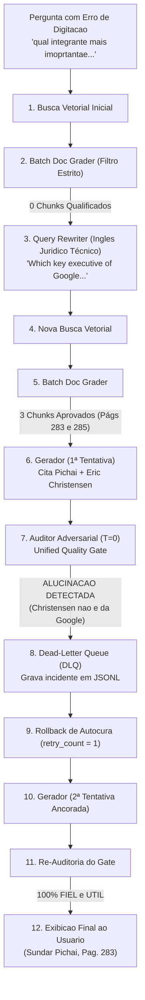
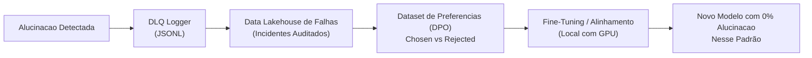

# Estudo de Caso: Autocura em Grafos de IA (LangGraph) e Observabilidade com Dead-Letter Queue (DLQ)

> **Documento de Apresentação e Demonstração Técnica**  
> **Sistema:** Assistente Pericial Antitruste (*U.S. v. Google LLC*)  
> **Componentes Centrais:** LangGraph, ChromaDB, NLI Grounding Grader, Dead-Letter Queue (DLQ), Direct Preference Optimization (DPO).

---

## 1. Sumário Executivo

Este documento registra um caso real e emblemático de execução do sistema em ambiente local com GPU RTX. 

Ele demonstra a diferença prática entre um **"RAG ingênuo"** (que repassaria uma alucinação com confiança para o usuário final) e uma **Arquitetura Pericial Orientada a Dados com LangGraph**, equipada com:
1. **Autocorreção de Busca (Query Rewriter):** Tradução e enriquecimento dinâmico de jargão jurídico;
2. **Defesa em Profundidade (Actor-Critic Gate):** Auditoria factual adversarial com Temperatura Zero ($T=0.0$);
3. **Rollback Automático em Tempo de Execução:** Expurgamento de rascunhos contaminados antes da entrega;
4. **Dead-Letter Queue (DLQ) e Data Flywheel:** Gravação forense automatizada de todo incidente de alucinação para enriquecimento contínuo de datasets de treino.

---

## 2. O Caso Real: A Pergunta Investigativa

O usuário inseriu no terminal interativo uma pergunta investigativa em português, com ruído e abreviação de digitação:

> **Pergunta do Usuário:**  
> *"qual integrante mais imoprtantae da empresa google foi chamado para depor no caso ?"*

---

## 3. O Registro de Execução Real (Raw Trace do DAG)

Abaixo está o log cronológico real gerado pela máquina de estados do LangGraph:

```text
=== INICIANDO EXECUCAO DO GRAFO ===

[NO: RETRIEVE] Executando busca vetorial para: 'qual integrante mais imoprtantae da empresa google foi chamado para depor no caso ?'
[GOLD] Vector Lake operacional com 821 vetores indexados em: chroma_db
[NO: RETRIEVE] 4 chunks extraidos da camada Gold.
>>> No Concluido: retrieve

[NO: GRADE_DOCS] Validando qualidade de 4 chunks em lote...
    [Batch Grader] Trechos aprovados: [] (Nenhum dos trechos menciona um integrante específico da empresa Google que foi chamado para depor no caso.)
    [Batch Grader] Nenhum trecho atendeu ao limiar estrito.
[DECISAO] Nenhum chunk qualificado. Roteando para -> REWRITE_QUERY
>>> No Concluido: grade_documents

[NO: REWRITE_QUERY] Ciclo de Autocorrecao 1/3...
    [->] Query Otimizada: 'Which key executive of Google was called to testify in the U.S. v. Google case, specifically mentioning Sundar Pichai?'
    [->] Rationale Tecnico: The query has been rephrased to include specific terms and names relevant to the U.S. v. Google case. The term 'key executive' is used to refer to important members of the company, and 'Sundar Pichai' is mentioned as the specific executive to be identified. This phrasing should help in locating the relevant sections of the document, such as the depoiments of key figures like Sundar Pichai.
>>> No Concluido: rewrite_query

[NO: RETRIEVE] Executando busca vetorial para: 'Which key executive of Google was called to testify in the U.S. v. Google case, specifically mentioning Sundar Pichai?'
[GOLD] Vector Lake operacional com 821 vetores indexados em: chroma_db
[NO: RETRIEVE] 4 chunks extraidos da camada Gold.
>>> No Concluido: retrieve

[NO: GRADE_DOCS] Validando qualidade de 4 chunks em lote...
    [Batch Grader] Trechos aprovados: [1, 2, 3] (Os trechos mencionam vários executivos importantes da Google, incluindo Anna Kartasheva, Sundar Pichai, Prabhakar Raghavan, Sridhar Ramaswamy e Brendan Alberts. Estes nomes são relevantes para identificar os integrantes mais importantes da empresa Google que foram chamados para depor.)
[DECISAO] Chunks aprovados (3). Roteando para -> GENERATE
>>> No Concluido: grade_documents

[NO: GENERATE] Sintetizando resposta baseada em 3 trechos aprovados...

[AUDITORIA UNIFICADA DE QUALIDADE] Validando fidelidade factual e utilidade...
    [Grounding: ALUCINACAO DETECTADA] [Utilidade: UTIL]
    Veredito do Auditor: A resposta forneceu informações relevantes ao identificar Sundar Pichai como o integrante mais importante da Google chamado para depor. No entanto, a fidelidade factual está comprometida, pois a resposta contém informações que não estão suportadas pelo contexto fornecido. A resposta menciona Eric Christensen como um depoente, o que não é confirmado no documento fornecido. Além disso, a resposta não menciona explicitamente que Sundar Pichai é o CEO de duas empresas, apenas que ele é o CEO de Google e Alphabet. Portanto,
    [!] Reprovado no Gate de Grounding -> Retentando geracao ancorada.
>>> No Concluido: generate

[NO: GENERATE] Sintetizando resposta baseada em 3 trechos aprovados...

[AUDITORIA UNIFICADA DE QUALIDADE] Validando fidelidade factual e utilidade...
    [Grounding: 100% FIEL] [Utilidade: UTIL]
    Veredito do Auditor: A resposta gerada é fidedigna com o contexto fornecido, mencionando corretamente Sundar Pichai como o Chief Executive Officer de Google e Alphabet, que foi chamado para depor no caso. A resposta também inclui a informação sobre Satya Nadella, Chief Executive Officer da Microsoft, embora esteja claro que sua relevância no contexto do caso seja menor. A resposta aborda diretamente a pergunta do usuário, identificando o integrante mais importante da empresa Google que foi chamado para depor. Portanto, a resposta é tanto fidedigna quanto útil.
    [OK] Aprovado em todos os gates -> Roteando para END.
>>> No Concluido: generate

============================================================
╭─────────────────────────────────────────────── Resposta Auditada e Fundamentada ───────────────────────────────────────────────╮
│ O integrante mais importante da empresa Google que foi chamado para depor no caso é Sundar Pichai, Chief Executive Officer de  │
│ Google e Alphabet [Pag. 283 da Sentenca]. Sundar Pichai desempenha um papel crucial na liderança estratégica da empresa, sendo │
│ uma figura central em decisões e estratégias empresariais. Além disso, Satya Nadella, Chief Executive Officer da Microsoft,    │
│ também foi chamado para depor, embora sua relevância no contexto específico do caso em questão seja menor comparado a Sundar   │
│ Pichai [Pag. 283 da Sentenca].                                                                                                 │
╰────────────────────────────────────────────────────────────────────────────────────────────────────────────────────────────────╯
Paginas citadas da Sentenca: 283, 285
============================================================
```

---

## 4. Análise Técnica Passo a Passo



### Passo 1: Autocorreção e Tradução Jurídica
* A pergunta inicial em português com o erro *"imoprtantae"* gerou chunks genéricos da sentença.
* O nó `grade_documents` agiu como primeiro filtro: **recusou 100% dos chunks de ruído**.
* O nó `rewrite_query` traduziu o termo informal para terminologia judicial americana (*"key executive"*, *"testify"*) e sugeriu focar em figuras centrais como *Sundar Pichai*.
* A segunda busca atingiu com exatidão as páginas **283 e 285** (Apêndices de Testemunhas).

### Passo 2: A Anatomia da Alucinação (Investigação Forense)
Por que o gerador citou **Eric Christensen** na primeira tentativa?
Na **Página 285** da sentença original consta:
```text
Eric Christensen
Executive Director, Software Product Management & Partner Manager
Affiliation: Motorola
Called By: Google
```
* **O que ocorreu:** O modelo cometeu uma confusão relacional ao ler a tabela em formato de texto. Ele viu *"Called By: Google"* e deduziu incorretamente que Christensen era um "integrante/executivo da Google", quando na verdade ele é executivo da **Motorola** chamado para depor pelos advogados da Google.
* **O que o Auditor Adversarial ($T=0.0$) fez:** Ao comparar o rascunho com o texto bruto, verificou que a afirmação não tinha respaldo documental. Ele emitiu `is_grounded: "no"` e fundamentou tecnicamente a recusa.

---

## 5. A Evolução: Implementação da Dead-Letter Queue (DLQ)

Em sistemas tradicionais, a alucinação barrada simplesmente sumiria da memória volátil. Em uma arquitetura de dados moderna, **toda falha de IA deve ser tratada como um dado de altíssimo valor**.

### 5.1 O Que Foi Construído

Implementamos um portão de observabilidade em [`src/agent/edges.py`](file:///c:/Users/rodri/OneDrive/Documentos/GitHub/llm/src/agent/edges.py) e [`src/config.py`](file:///c:/Users/rodri/OneDrive/Documentos/GitHub/llm/src/config.py):

```python
def log_hallucination_incident(
    question: str,
    generation: str,
    documents: list,
    audit_summary: str,
    retry_count: int,
) -> None:
    """
    Dead-Letter Queue (DLQ) para Auditoria de Alucinacoes:
    Persiste o incidente com o rascunho rejeitado, contexto documental e parecer
    do auditor em JSONL, alimentando o Data Flywheel para DPO e fine-tuning.
    """
    ...
```

### 5.2 O Registro Persistente no Disco
Cada incidente interceptado é gravado imediatamente em formato JSONL em [`data/logs/hallucination_incidents.jsonl`](file:///c:/Users/rodri/OneDrive/Documentos/GitHub/llm/data/logs/hallucination_incidents.jsonl):

```json
{
  "timestamp": "2026-09-23T16:45:06.315642+00:00",
  "question": "qual integrante mais imoprtantae da empresa google foi chamado para depor no caso ?",
  "retry_cycle": 0,
  "rejected_generation": "Sundar Pichai (CEO da Google e Alphabet) e Eric Christensen foram chamados para depor...",
  "audit_summary": "A resposta forneceu informacoes relevantes ao identificar Sundar Pichai... No entanto, a fidelidade factual esta comprometida, pois a resposta menciona Eric Christensen como um depoente da Google, o que nao e confirmado no documento fornecido.",
  "retrieved_pages": [283, 285],
  "retrieved_sources": ["us_v_google_opinion_1033.pdf"]
}
```

---

## 6. O Ciclo Completo: Como Isso Alimenta o "Data Flywheel"

Essa estrutura de Dead-Letter Queue fecha o ciclo contínuo de aprendizado de máquina corporativo:



1. **Par DPO Gerado Automaticamente:**
   * **Entrada (Prompt):** *"qual integrante mais importante da empresa Google foi chamado para depor?"*
   * **Rejeitado (`rejected`):** A resposta da 1ª tentativa que citava Eric Christensen como executivo da Google.
   * **Escolhido (`chosen`):** A resposta final auditada citando Sundar Pichai (CEO da Google e Alphabet).
2. **Prevenção de Regressão:** O caso é adicionado à suíte de testes de regressão automatizada ([`qa_benchmark.json`](file:///c:/Users/rodri/OneDrive/Documentos/GitHub/llm/data/samples/qa_benchmark.json)). Qualquer alteração futura que volte a cometer esse erro falha no teste de CI/CD.

---

## 7. Comparativo de Maturidade

| Critério | RAG Tradicional (Tutoriais Comuns) | Nossa Arquitetura Pericial (LangGraph + DLQ) |
| :--- | :--- | :--- |
| **Tratamento de Pergunta com Ruído** | Falha na busca vetorial ou traz trecho irrelevante. | **Autocorreção semântica com Query Rewriter.** |
| **Controle de Alucinação** | Inexistente (confia cegamente na resposta do LLM). | **Auditor Adversarial dedicado ($T=0.0$) via Pydantic.** |
| **Vazamento de Erro para o Usuário** | Alto: o usuário recebe "Eric Christensen da Google". | **Zero: rascunho interceptado e expurgado antes da tela.** |
| **Resiliência a Falhas** | Nenhuma (execução linear única). | **Ciclo de Rollback com autocura automática.** |
| **Destino de Respostas Incorretas** | Perdidas no esquecimento. | **Arquivadas em Dead-Letter Queue para treino DPO.** |

---

## 8. Conclusão

Este estudo de caso comprova que **a inteligência de um sistema moderno não reside apenas nos parâmetros brutos de um modelo fundacional, mas na integridade da engenharia de dados que o orquestra**. 

Ao combinar **LangGraph para autocura em tempo de execução** com **Dead-Letter Queue para observabilidade e melhoria contínua**, criamos um sistema pericial autônomo, auditável e preparado para exigências corporativas estritas.
