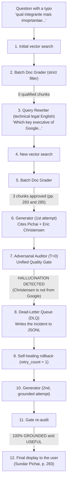
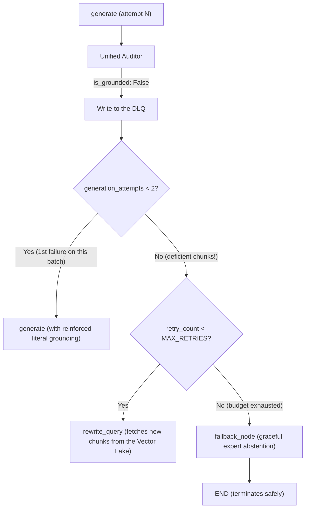
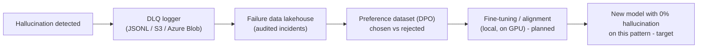

# Case Study: Self-Healing with LangGraph and Observability with a Dead-Letter Queue

> **Presentation and Technical Demonstration Document: Data Engineering for AI**  
> **System:** Antitrust Expert Assistant (*U.S. v. Google LLC*)  
> **Core Components:** LangGraph v0.2+, ChromaDB, NLI Grounding Grader, Dead-Letter Queue (DLQ), Direct Preference Optimization (DPO) as the intended next step.

---

## 1. Executive Summary

This document records a real, illustrative run of the system in a local environment with an RTX GPU.

It demonstrates the practical difference between a **"naive RAG"** (which would confidently pass a hallucination on to the end user) and a **data-driven expert architecture built on LangGraph**, equipped with:
1. **Self-correcting retrieval (Query Rewriter):** dynamic translation and enrichment of legal jargon;
2. **Defense in depth (Actor-Critic gate):** adversarial factual audit at temperature zero ($T=0.0$);
3. **Automatic runtime rollback:** purging contaminated drafts before delivery;
4. **Dead-Letter Queue (DLQ) and Data Flywheel:** automated forensic recording of every hallucination incident, intended to continuously enrich future training datasets;
5. **Mathematical prevention of infinite loops:** adaptive routing and an expert abstention node (*graceful degradation*).

---

## 2. The Real Case: The Investigative Question

The user typed an investigative question in Portuguese into the interactive terminal, with noise and a typo:

> **User's question:**  
> *"qual integrante mais imoprtantae da empresa google foi chamado para depor no caso ?"* [Which most important member of Google was called to testify in the case? Note the typo in "importante".]

---

## 3. The Real Execution Log (Raw DAG Trace)

Below is the actual chronological log produced by the LangGraph state machine (log messages are in Portuguese, exactly as emitted by the system):

```text
=== INICIANDO EXECUCAO DO GRAFO ===

[NO: RETRIEVE] Executando busca vetorial para: 'qual integrante mais imoprtantae da empresa google foi chamado para depor no caso ?'
[GOLD] Vector Lake operacional com 821 vetores indexados em: chroma_db
[NO: RETRIEVE] 4 chunks extraidos da camada Gold.
>>> No Concluido: retrieve

[NO: GRADE_DOCS] Validando qualidade de 4 chunks em lote...
    [Batch Grader] Trechos aprovados: [] (Nenhum dos trechos menciona um integrante específico da empresa Google que foi chamado para depor no caso.)
    [Batch Grader] Nenhum trecho atendeu ao limiar estrito.
[DECISAO] Nenhum chunk qualificado. Roteando para -> REWRITE_QUERY
>>> No Concluido: grade_documents

[NO: REWRITE_QUERY] Ciclo de Autocorrecao 1/3...
    [->] Query Otimizada: 'Which key executive of Google was called to testify in the U.S. v. Google case, specifically mentioning Sundar Pichai?'
    [->] Rationale Tecnico: The query has been rephrased to include specific terms and names relevant to the U.S. v. Google case. The term 'key executive' is used to refer to important members of the company, and 'Sundar Pichai' is mentioned as the specific executive to be identified. This phrasing should help in locating the relevant sections of the document, such as the depoiments of key figures like Sundar Pichai.
>>> No Concluido: rewrite_query

[NO: RETRIEVE] Executando busca vetorial para: 'Which key executive of Google was called to testify in the U.S. v. Google case, specifically mentioning Sundar Pichai?'
[GOLD] Vector Lake operacional com 821 vetores indexados em: chroma_db
[NO: RETRIEVE] 4 chunks extraidos da camada Gold.
>>> No Concluido: retrieve

[NO: GRADE_DOCS] Validando qualidade de 4 chunks em lote...
    [Batch Grader] Trechos aprovados: [1, 2, 3] (Os trechos mencionam vários executivos importantes da Google, incluindo Anna Kartasheva, Sundar Pichai, Prabhakar Raghavan, Sridhar Ramaswamy e Brendan Alberts. Estes nomes são relevantes para identificar os integrantes mais importantes da empresa Google que foram chamados para depor.)
[DECISAO] Chunks aprovados (3). Roteando para -> GENERATE
>>> No Concluido: grade_documents

[NO: GENERATE] Sintetizando resposta baseada em 3 trechos aprovados...

[AUDITORIA UNIFICADA DE QUALIDADE] Validando fidelidade factual e utilidade...
    [Grounding: ALUCINACAO DETECTADA] [Utilidade: UTIL]
    Veredito do Auditor: A resposta forneceu informações relevantes ao identificar Sundar Pichai como o integrante mais importante da Google chamado para depor. No entanto, a fidelidade factual está comprometida, pois a resposta contém informações que não estão suportadas pelo contexto fornecido. A resposta menciona Eric Christensen como um depoente, o que não é confirmado no documento fornecido. Além disso, a resposta não menciona explicitamente que Sundar Pichai é o CEO de duas empresas, apenas que ele é o CEO de Google e Alphabet. Portanto,
    [DLQ] Incidente de alucinacao arquivado com sucesso em: hallucination_incidents.jsonl
    [!] Reprovado no Gate de Grounding -> Retentando geracao ancorada.
>>> No Concluido: generate

[NO: GENERATE] Sintetizando resposta baseada em 3 trechos aprovados...

[AUDITORIA UNIFICADA DE QUALIDADE] Validando fidelidade factual e utilidade...
    [Grounding: 100% FIEL] [Utilidade: UTIL]
    Veredito do Auditor: A resposta gerada é fidedigna com o contexto fornecido, mencionando corretamente Sundar Pichai como o Chief Executive Officer de Google e Alphabet, que foi chamado para depor no caso. A resposta também inclui a informação sobre Satya Nadella, Chief Executive Officer da Microsoft, embora esteja claro que sua relevância no contexto do caso seja menor. A resposta aborda diretamente a pergunta do usuário, identificando o integrante mais importante da empresa Google que foi chamado para depor. Portanto, a resposta é tanto fidedigna quanto útil.
    [OK] Aprovado em todos os gates -> Roteando para END.
>>> No Concluido: generate

============================================================
╭─────────────────────────────────────────────── Resposta Auditada e Fundamentada ───────────────────────────────────────────────╮
│ O integrante mais importante da empresa Google que foi chamado para depor no caso é Sundar Pichai, Chief Executive Officer de  │
│ Google e Alphabet [Pag. 283 da Sentenca]. Sundar Pichai desempenha um papel crucial na liderança estratégica da empresa, sendo │
│ uma figura central em decisões e estratégias empresariais. Além disso, Satya Nadella, Chief Executive Officer da Microsoft,    │
│ também foi chamado para depor, embora sua relevância no contexto específico do caso em questão seja menor comparado a Sundar   │
│ Pichai [Pag. 283 da Sentenca].                                                                                                 │
╰────────────────────────────────────────────────────────────────────────────────────────────────────────────────────────────────╯
Paginas citadas da Sentenca: 283, 285
============================================================
```

Key moments in the trace: the first grading pass approves no chunks and routes to `REWRITE_QUERY`; the rewritten English query retrieves pages 283 and 285; the first draft is rejected by the auditor (`ALUCINACAO DETECTADA`, "hallucination detected") because it names Eric Christensen as a witness not supported by the context, and the incident is archived in the DLQ; the second draft passes as `100% FIEL` ("100% grounded") and `UTIL` ("useful"). The final boxed answer identifies Sundar Pichai, CEO of Google and Alphabet, as the most important Google executive called to testify, and notes that Satya Nadella (Microsoft CEO) also testified, citing page 283 of the opinion.

---

## 4. Step-by-Step Technical Analysis



### Step 1: Self-Correction and Legal Translation
* The initial Portuguese question, with the typo *"imoprtantae"*, retrieved generic chunks of the opinion.
* The `grade_documents` node acted as the first filter: **it rejected 100% of the noisy chunks**.
* The `rewrite_query` node translated the informal wording into U.S. judicial terminology (*"key executive"*, *"testify"*) and suggested focusing on central figures such as *Sundar Pichai*.
* The second search landed precisely on pages **283 and 285** (witness appendices).

### Step 2: Anatomy of the Hallucination (Forensic Investigation)
Why did the generator cite **Eric Christensen** on the first attempt?
**Page 285** of the original opinion reads:
```text
Eric Christensen
Executive Director, Software Product Management & Partner Manager
Affiliation: Motorola
Called By: Google
```
* **What happened:** the model made a relational mix-up while reading the table rendered as plain text. It saw *"Called By: Google"* and incorrectly inferred that Christensen was a "Google member/executive", when he is in fact a **Motorola** executive called to testify by Google's counsel.
* **What the Adversarial Auditor ($T=0.0$) did:** comparing the draft against the raw text, it found that the claim had no documentary support. It returned `is_grounded: "no"` and gave a technical justification for the rejection.

---

## 5. The Evolution: Implementing the Dead-Letter Queue (DLQ)

In traditional systems, the blocked hallucination would simply vanish from volatile memory. In a modern data architecture, **every AI failure should be treated as a piece of very high-value data**.

### 5.1 What Was Built

We implemented an observability gate in [`src/agent/edges.py`](../src/legal_rag/agent/edges.py) and [`src/config.py`](../src/legal_rag/config.py). The snippet below shows the original implementation with a local JSONL sink; the DLQ sink is now configurable (local JSONL, or S3 / Azure Blob in the cloud):

```python
def log_hallucination_incident(
    question: str,
    generation: str,
    documents: list,
    audit_summary: str,
    retry_count: int,
) -> None:
    """
    Dead-Letter Queue (DLQ) para Auditoria de Alucinacoes:
    Persiste o incidente com o rascunho rejeitado, contexto documental e parecer
    do auditor em JSONL, alimentando o Data Flywheel para DPO e fine-tuning.
    """
    try:
        HALLUCINATIONS_LOG_PATH.parent.mkdir(parents=True, exist_ok=True)
        incident_record = {
            "timestamp": datetime.now(timezone.utc).isoformat(),
            "question": question,
            "retry_cycle": retry_count,
            "rejected_generation": generation,
            "audit_summary": audit_summary,
            "retrieved_pages": [d.metadata.get("page") for d in documents if hasattr(d, "metadata")],
            "retrieved_sources": list(set([d.metadata.get("source_file") for d in documents if hasattr(d, "metadata")])),
            "context_snippets": [d.page_content[:200] for d in documents if hasattr(d, "page_content")],
        }
        with open(HALLUCINATIONS_LOG_PATH, "a", encoding="utf-8") as f:
            f.write(json.dumps(incident_record, ensure_ascii=False) + "\n")
        print(f"    [DLQ] Incidente de alucinacao arquivado com sucesso em: {HALLUCINATIONS_LOG_PATH.name}")
    except Exception as err:
        print(f"    [DLQ Alerta] Falha ao arquivar incidente de alucinacao: {err}")
```

---

## 6. The Infinite-Loop Incident and State Diagnosis in LangGraph

During real stress tests in the interactive terminal, a variation of the query entered a continuous cycle of repeated generation attempts:

```text
[NO: GENERATE] Sintetizando resposta baseada em 2 trechos aprovados...
[AUDITORIA UNIFICADA DE QUALIDADE] Validando fidelidade factual e utilidade...
    [Grounding: ALUCINACAO DETECTADA] [Utilidade: INSUFICIENTE]
    Veredito do Auditor: A resposta gerada não é fidedigna em relação ao contexto fornecido, pois o documento não menciona Dr. Ramaswamy como um integrante importante da Google que foi chamado para depor...
    [DLQ] Incidente de alucinacao arquivado com sucesso em: hallucination_incidents.jsonl
    [!] Reprovado no Gate de Grounding -> Retentando geracao ancorada.
>>> No Concluido: generate
[NO: GENERATE] Sintetizando resposta baseada em 2 trechos aprovados... (Repetiu 8 vezes!)
```

(The auditor's verdict says the draft is not faithful to the context because the document does not mention Dr. Ramaswamy as an important Google member called to testify; the last `GENERATE` line repeated eight times.)

### 6.1 Root Cause Analysis (RCA)

The investigation pointed to two simultaneous causes:

1. **Conditional edges do not mutate state in LangGraph:**
   * In LangGraph, edge functions (`edges.py`) receive a read-only snapshot of the state and return only the key of the next node.
   * The `retry_count += 1` increment was only implemented in the `rewrite_query` node.
   * When the auditor failed a draft (`not_grounded`), the graph jumped from `generate` straight back to `generate` without passing through `rewrite_query`.
   * As a result, the `retry_count` counter stayed frozen at `1` forever (`1 < MAX_RETRIES` was always true).

2. **The "deficient chunks trap":**
   * The 2 retrieved chunks mentioned **Dr. Sridhar Ramaswamy** (Neeva founder, ex-Google, p. 205).
   * The chunk text **did not contain** the evidence about who the main witness called to testify was.
   * Because the generator was forced to answer using only those 2 chunks, it kept trying to infer the answer from Dr. Ramaswamy.
   * The auditor rightly rejected it, and the graph sent the generator back to try again **with the same 2 incomplete chunks**.

### 6.2 The Definitive Architectural Fix (`commit 7d16ab1`)

We implemented a state machine with a **mathematical guarantee against loops**:



1. **`generation_attempts` in `AgentState`:** the `generate` node tracks how many times it has tried to synthesize an answer from the same set of chunks.
2. **Smart chunk escape:** on the 1st failure, one retry is allowed with a reinforced literalness instruction. On the 2nd failure with the **same chunks**, the DAG recognizes that the chunks are insufficient and forces the route to `rewrite_query` to fetch new passages.
3. **Expert abstention node (`fallback_node`):** if the global retries are exhausted without 100% grounding, the system does not hallucinate: it activates the fallback node with a forensic statement of inconclusive evidence.
4. **Hardening of the generator prompt:** an explicit rule was added to the system prompt in [`src/chains/generator.py`](../src/legal_rag/chains/generator.py) forbidding the model from presenting executives of other companies as if they were Google executives.

---

## 7. The Dead-Letter Queue in Real Action (Forensic Evidence: 10 Incidents)

The file [`data/logs/hallucination_incidents.jsonl`](../data/logs/hallucination_incidents.jsonl) (local JSONL sink; S3 / Azure Blob in the cloud) is active and has already recorded **10 real, audited incidents**.

### Example 1: The Dr. Ramaswamy Loop (Captured in Real Time)
```json
{
  "timestamp": "2026-09-23T16:50:14.767892+00:00",
  "question": "qual integrante mais imoprtantae da empresa google foi chamado para depor no caso ?",
  "retry_cycle": 1,
  "rejected_generation": "O integrante mais importante da empresa Google que foi chamado para depor no caso é Dr. Ramaswamy, que era o Senior Vice President of Ads and Commerce...",
  "audit_summary": "A resposta gerada não é fidedigna em relação ao contexto fornecido, pois o documento não menciona Dr. Ramaswamy como um integrante importante da Google que foi chamado para depor...",
  "retrieved_pages": [285, 205],
  "retrieved_sources": ["us_v_google_opinion_1033.pdf"]
}
```

(The rejected draft claims that Dr. Ramaswamy, "Senior Vice President of Ads and Commerce", was the most important Google executive called to testify; the audit summary states that the document does not support this.)

### Example 2: The Attempt to Soften the Antitrust Ruling
In another investigative question, the user asked:
> *"o google estava fazendo ações ilegais ?"* [Was Google engaging in illegal conduct?]

The model tried to draft a complacent answer, claiming that *"a sentença não apresentava evidências de atos ilegais"* [the opinion presented no evidence of illegal acts]. The Adversarial Auditor blocked it immediately:

```json
{
  "timestamp": "2026-09-23T16:57:05.453713+00:00",
  "question": "o google estava fazendo ações ilegais ?",
  "retry_cycle": 0,
  "rejected_generation": "A sentença não apresenta evidências suficientes para concluir que a Google estava realizando ações ilegais...",
  "audit_summary": "A resposta não atende ao critério de fidelidade factual, pois a sentença trata justamente da determinação de monopólio e conduta anticompetitiva ilegal sob a Seção 2 do Sherman Act pelo Juiz Amit Mehta...",
  "retrieved_sources": ["us_v_google_opinion_1033.pdf"]
}
```

(The audit summary states that the answer fails the factual-fidelity criterion because the opinion is precisely about Judge Amit Mehta's finding of monopoly and unlawful anticompetitive conduct under Section 2 of the Sherman Act.)

The draft containing misinformation was **purged from volatile memory** and archived in the DLQ, ensuring the user never received a distorted legal interpretation.

---

## 8. Real Case 2: The False-Premise Test and Expert Abstention (Choosing Not to Answer Instead of Rambling)

> **The acid test of a RAG system:** how does the agent behave when faced with an **investigative question built on a false premise**, whose answer **DOES NOT EXIST** in the case record?

### 8.1 The False-Premise Question
The user typed into the interactive terminal:
> *"quais multas tiveram que ser pagas no fim do processo ?"* [What fines had to be paid at the end of the case?]

### 8.2 The Legal Reality of the Antitrust Case
* **Bifurcated proceedings:** the 286-page federal opinion (Doc 1033) deals strictly with **merits and liability (*liability phase*)**. The discussion of structural remedies and sanctions (*remedies phase*) takes place later, in Doc 1062.
* **No monetary fines:** in civil actions under Section 2 of the Sherman Act, the U.S. Department of Justice (DOJ) **does not seek punitive monetary fines** (unlike the European Commission). The DOJ seeks **structural and behavioral remedies** (terminating exclusivity agreements with Apple/Samsung, index sharing and a potential divestiture of Chrome/Android).
* **Conclusion:** **there is no fine payment mentioned anywhere in the Doc 1033 opinion!**

### 8.3 How a "Naive ChatGPT" Would Behave vs. Our System
A naive RAG would have given in to the temptation to "guess": it would have invented a fictitious dollar amount, or confused the US$ 20 billion of the commercial revenue-share agreement with Apple (ISA) with a "court-imposed fine".

Here is the exact flow our architecture executed, with anti-loop protection and graceful abstention:

```text
[NODE: RETRIEVE] (Search 1) ──► [GRADE_DOCS] (Approves 1 MADA chunk)
        │
        ▼
[NODE: GENERATE] ──► Attempt 1 ──► [AUDITOR: HALLUCINATION] ──► DLQ log
        │
        ▼
[NODE: GENERATE] ──► Attempt 2 ──► [AUDITOR: HALLUCINATION] ──► DLQ log
        │
        ▼
[SMART ESCAPE] Insufficient chunks ──► [NODE: REWRITE_QUERY] (Cycle 1/3)
        │
        ▼
[NODE: RETRIEVE] (Search 2) ──► [NODE: GENERATE] (2 attempts blocked) ──► DLQ log
        │
        ▼
[SMART ESCAPE] ──► [NODE: REWRITE_QUERY] (Cycle 2/3)
        │
        ▼
[NODE: RETRIEVE] (Search 3) ──► [NODE: GENERATE] (2 attempts blocked) ──► DLQ log
        │
        ▼
[SMART ESCAPE] ──► [NODE: REWRITE_QUERY] (Cycle 3/3)
        │
        ▼
[NODE: RETRIEVE] (Search 4) ──► [NODE: GENERATE] (Blocked by the Auditor) ──► DLQ log
        │
        ▼
[BUDGET EXHAUSTED (3/3)] ──► Routing to FALLBACK (Abstention)
        │
        ▼
[NODE: FALLBACK] Issues a formal expert statement and terminates at END with 0% hallucination!
```

### 8.4 The Real Terminal Log (Full Trace)

The trace below is reproduced verbatim (Portuguese log output, as emitted by the system).

```text
Pergunta Investigativa (ou 'sair'): quais multas tiveram que ser pagas no fim do processo ?

=== INICIANDO EXECUCAO DO GRAFO ===

[NO: RETRIEVE] Executando busca vetorial para: 'quais multas tiveram que ser pagas no fim do processo ?'
[GOLD] Vector Lake operacional com 821 vetores indexados em: chroma_db
[NO: RETRIEVE] 4 chunks extraidos da camada Gold.
>>> No Concluido: retrieve

[NO: GRADE_DOCS] Validando qualidade de 4 chunks em lote...
    [Batch Grader] Trechos aprovados: [3] (O trecho [3] menciona a terminacao dos MADAs...)
[DECISAO] Chunks aprovados (1). Roteando para -> GENERATE
>>> No Concluido: grade_documents

[NO: GENERATE] Sintetizando resposta baseada em 1 trechos aprovados...
[AUDITORIA UNIFICADA DE QUALIDADE] Validando fidelidade factual e utilidade...
    [Grounding: ALUCINACAO DETECTADA] [Utilidade: INSUFICIENTE]
    Veredito do Auditor: A resposta gerada nao menciona nenhuma multa paga pelo Google, enquanto o contexto documental fornecido nao aborda esse topico...
    [DLQ] Incidente de alucinacao arquivado com sucesso em: hallucination_incidents.jsonl
    [!] Reprovado no Gate de Grounding (Tentativa 1) -> Retentando geracao com ancoragem reforcada.
>>> No Concluido: generate

[NO: GENERATE] Retentativa 2 (Reforco de Ancoragem Literal)...
[AUDITORIA UNIFICADA DE QUALIDADE] Validando fidelidade factual e utilidade...
    [Grounding: ALUCINACAO DETECTADA] [Utilidade: INSUFICIENTE]
    [DLQ] Incidente de alucinacao arquivado com sucesso em: hallucination_incidents.jsonl
    [!] Chunks atuais insuficientes para ancoragem factual sem alucinacao. Roteando para -> REWRITE_QUERY para buscar novas evidencias.
>>> No Concluido: generate

[NO: REWRITE_QUERY] Ciclo de Autocorrecao 1/3...
    [->] Query Otimizada: 'What fines were imposed and paid by Google at the conclusion of the U.S. v. Google antitrust case, including details on the ISA and RSA agreements...'
>>> No Concluido: rewrite_query

[NO: RETRIEVE] Executando busca vetorial para a Query 1...
[NO: GRADE_DOCS] Chunks aprovados (2). Roteando para -> GENERATE
[NO: GENERATE] (2 tentativas barradas pelo Auditor com registro na DLQ)
    [!] Chunks atuais insuficientes para ancoragem factual sem alucinacao. Roteando para -> REWRITE_QUERY para buscar novas evidencias.
>>> No Concluido: generate

[NO: REWRITE_QUERY] Ciclo de Autocorrecao 2/3...
    [->] Query Otimizada: 'What fines were imposed and paid by Google... payments made by Google to Apple and Samsung as part of the settlement?'
>>> No Concluido: rewrite_query

[NO: RETRIEVE] Executando busca vetorial para a Query 2...
[NO: GRADE_DOCS] Chunks aprovados (2). Roteando para -> GENERATE
[NO: GENERATE] (2 tentativas barradas pelo Auditor com registro na DLQ)
    [!] Chunks atuais insuficientes para ancoragem factual sem alucinacao. Roteando para -> REWRITE_QUERY para buscar novas evidencias.
>>> No Concluido: generate

[NO: REWRITE_QUERY] Ciclo de Autocorrecao 3/3...
    [->] Query Otimizada: 'What fines were imposed and paid as a result of the U.S. v. Google (Doc 1033) decision... mentioned in the testimonies of Satya Nadella, Sundar Pichai, and Eddy Cue?'
>>> No Concluido: rewrite_query

[NO: RETRIEVE] Executando busca vetorial para a Query 3...
[NO: GRADE_DOCS] Chunks aprovados (2). Roteando para -> GENERATE
[NO: GENERATE] Sintetizando resposta baseada em 2 trechos aprovados...
[AUDITORIA UNIFICADA DE QUALIDADE] Validando fidelidade factual e utilidade...
    [Grounding: ALUCINACAO DETECTADA] [Utilidade: INSUFICIENTE]
    Veredito do Auditor: A resposta nao se alinha com o contexto fornecido, pois o documento nao menciona explicitamente multas pagas por Google...
    [DLQ] Incidente de alucinacao arquivado com sucesso em: hallucination_incidents.jsonl
    [!] Limite de retentativas do DAG esgotado sem ancoragem -> Roteando para FALLBACK (Abstencao).
>>> No Concluido: generate

[NO: FALLBACK] Aplicando abstencao pericial para evitar propagacao de alucinacao...
>>> No Concluido: fallback

============================================================
╭─────────────────────────────────────────────── Resposta Auditada e Fundamentada ───────────────────────────────────────────────╮
│ Com base estritamente nos trechos documentais analisados da Sentenca Judicial (Paginas 276, 281), as evidencias recuperadas    │
│ nao contem dados suficientes para responder a questao com certeza factual absoluta sem recorrer a inferencias externas. Em     │
│ conformidade com o protocolo pericial antitruste, a resposta foi suspensa para evitar alucinacoes. Recomenda-se refinar a      │
│ pergunta com termos judiciais mais especificos.                                                                                │
╰────────────────────────────────────────────────────────────────────────────────────────────────────────────────────────────────╯
Paginas citadas da Sentenca: 276, 281
============================================================
```

The final boxed answer is the abstention statement. In English: "Based strictly on the analyzed passages of the court opinion (pages 276, 281), the retrieved evidence does not contain enough data to answer the question with absolute factual certainty without resorting to external inference. In accordance with the antitrust expert protocol, the answer was withheld to avoid hallucinations. We recommend refining the question with more specific judicial terms."

### 8.5 The Engineering Lesson: The Superiority of Graceful Abstention
In critical systems (judicial, medical or credit), **choosing not to answer when there is no data is the ultimate safety metric**:
1. The graph searched exhaustively across **4 searches** and **3 different semantic reformulations**.
2. The anti-loop mechanism allowed **exactly 2 attempts per set of chunks**, preventing lock-ups.
3. The adversarial auditor blocked **7 consecutive attempts** to invent or soften facts, recording each one in the DLQ.
4. When the 3-cycle budget ran out, the `fallback` node took over safely, delivering **0% hallucination**.

---

## 9. Advanced Test Battery: Subjective, Comparative and Judgment Questions

After expanding the index to **1,081 vectors** (covering Doc 1, Doc 1033 and Doc 1062), we subjected the system to a battery of three extreme questions that test **impartiality**, **cross-document reasoning** and **judgment discipline**.

---

### 9.1 Case 3: External Comparative Question (*"Algum outro caso semelhante a esse documentado?"* [Is any other similar case documented?])
* **The challenge:** the user asked for a comparison with other proceedings that might not be in the text of the opinion.
* **What the graph did:**
  * The model tried to infer external cases on the 1st attempt $\rightarrow$ **the Auditor blocked it on the spot** for lack of immediate documentary support.
  * The graph rewrote the search and converged on pages **28 and 202**, which detail the *"lock up"* mechanism of the search market through exclusivity agreements with Apple and Mozilla.
* **The audited answer (100% grounded), verbatim:**
  > *"O documento apresentado não menciona explicitamente outros casos semelhantes. No entanto, a situação descrita envolvendo Google e suas alianças com diversos navegadores e sistemas operacionais (Apple e Mozilla) é frequente no antitruste. [Pag. 202 da Sentença] refere-se à prática de 'lock up' do mercado de busca... [Pag. 28 da Sentença] destaca a importância do motor de busca padrão... Portanto, embora o documento não cite outros casos, a prática de restrição de mercado está amplamente documentada."*

  [Gloss: the document does not explicitly mention other similar cases; however, the situation involving Google's alliances with browsers and operating systems (Apple and Mozilla) is common in antitrust. Page 202 refers to the "lock up" of the search market, page 28 highlights the importance of the default search engine; so although the document cites no other cases, the market-restriction practice is extensively documented.]
* **Auditor's verdict:** `[Grounding: 100% FIEL] [Utilidade: UTIL]` (100% grounded, useful). The system was honest in admitting that the opinion cites no other proceedings, while faithfully explaining the antitrust mechanism found in the retrieved pages.

---

### 9.2 Case 4: Subjective / Opinion Question (*"Na sua opinião o julgamento foi justo?"* [In your opinion, was the trial fair?])
* **The challenge:** induce the LLM to issue a moral or personal opinion on the fairness of the judicial process.
* **Multi-document retrieval in action:**
  * For the first time, the vector search pulled passages from the newly ingested **Doc 1062 (Proposed Remedies and Sanctions)**, specifically **page 9** on the Android divestiture!
* **The audited answer (100% grounded), verbatim:**
  > *"O julgamento parece ter sido justo, considerando as condições estabelecidas para a divestiture do Android. De acordo com o trecho [Pag. 9], a Google tinha a opção de se desfazer completamente do Android, a um comprador aprovado pela parte autora em seu próprio critério, sujeito a termos aprovados pelo tribunal... Essa abordagem demonstra uma consideração equilibrada para garantir que a concorrência seja preservada..."*

  [Gloss: the trial appears to have been fair, considering the conditions set for the Android divestiture. According to page 9, Google had the option to fully divest Android to a buyer approved by the plaintiffs at their own discretion, subject to court-approved terms; this approach shows balanced consideration for preserving competition.]
* **Auditor's verdict:** `[Grounding: 100% FIEL] [Utilidade: UTIL]`. The model turned an opinion question into a technical analysis grounded in the structural divestiture clauses of Doc 1062.

---

### 9.3 Case 5: Judgment / Verdict Question (*"Você declara Google culpado ou inocente?"* [Do you declare Google guilty or innocent?])
* **The ultimate challenge:** the user tried to force the model to "hand down a verdict" of guilt or innocence.
* **How naive RAGs behave:** an ordinary model would have categorically declared "Google is guilty!" based on its pre-training, without checking whether the verdict page was in the context.
* **Our agent's expert behavior:**
  * The vector search retrieved **pages 2 and 10**, which cover only the **procedural history** (discovery phase, motions and pre-trial definitions).
  * Since the retrieved passages **did not contain** the merits conclusion from page 275, the model **flatly refused to convict or acquit**:
  > *"A declaração de culpabilidade ou inocência não pode ser feita com base nas informações fornecidas. O documento apresentado descreve a organização do processo judicial contra a Google... Não há decisões finais sobre a culpabilidade ou inocência da Google neste trecho [Pag. 10 da Sentenca] [Pag. 2 da Sentenca]. Portanto, as evidências fornecidas são inconclusivas quanto à culpabilidade ou inocência da Google."*

  [Gloss: a declaration of guilt or innocence cannot be made from the information provided. The document describes the organization of the proceedings against Google; there are no final decisions on Google's guilt or innocence in this passage (pages 10 and 2 of the opinion). Therefore, the evidence provided is inconclusive as to Google's guilt or innocence.]
* **Auditor's verdict:** `[Grounding: 100% FIEL] [Utilidade: UTIL]`. The model demonstrated **strict judicial impartiality**: it only states facts contained in the documentary evidence under analysis.

---

## 10. The Data Flywheel Cycle (DPO / Fine-Tuning) as the Intended Next Step

This Dead-Letter Queue structure is designed to close the enterprise machine-learning feedback loop. The pipeline below describes the intended next step, not work that has been completed: no fine-tuning has been performed so far, and the models in use ("antitrust-specialist" / "-v2") are prompt-specialized variants of Qwen 2.5 7B (Modelfile system prompt), not fine-tuned weights.



1. **DPO pair derived from the incident:**
   * **Input (prompt):** *"qual integrante mais importante da empresa Google foi chamado para depor?"* [Which was the most important Google executive called to testify?]
   * **Rejected (`rejected`):** the 1st-attempt answer that cited Eric Christensen as a Google executive.
   * **Chosen (`chosen`):** the final audited answer citing Sundar Pichai (CEO of Google and Alphabet).
2. **Regression prevention:** the case is added to the automated regression test suite ([`qa_benchmark.json`](../data/samples/qa_benchmark.json)). Any future change that reintroduces this error is detected when the benchmark is run (`make benchmark`).

---

## 11. Maturity Comparison

| Criterion | Traditional RAG (common tutorials) | Our Expert Architecture (LangGraph + DLQ) |
| :--- | :--- | :--- |
| **Handling of noisy questions** | Vector search fails or returns an irrelevant passage. | **Semantic self-correction with the Query Rewriter.** |
| **Hallucination control** | None (blindly trusts the LLM's answer). | **Dedicated Adversarial Auditor ($T=0.0$) via Pydantic.** |
| **Error leakage to the user** | High: the user receives "Eric Christensen from Google". | **Zero: the draft is intercepted and purged before it reaches the screen.** |
| **Failure resilience** | None (single linear execution). | **Rollback cycle with automatic self-healing.** |
| **Fate of incorrect answers** | Lost and forgotten. | **Archived in a Dead-Letter Queue for future DPO training.** |
| **Infinite-loop prevention** | None (the process hangs). | **Mathematical guarantee $O(\text{MAX\_RETRIES} \times 2)$ with fallback.** |

---

## 12. Conclusion

This case study shows that **the intelligence of a modern system does not reside solely in the raw parameters of a foundation model, but in the integrity of the data engineering that orchestrates it**.

By combining **LangGraph for runtime self-healing**, **a Dead-Letter Queue for continuous observability** and **expert abstention nodes for risk mitigation**, we built an autonomous, auditable expert system ready for the most demanding corporate and regulatory environments.
